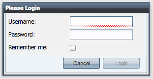
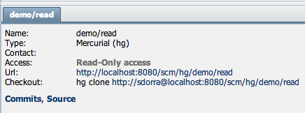

**Remember me**

The first new feature you notice when you start SCM-Manager 1.31, is the “Remember me” checkbox.

If you select this checkbox during login, SCM-Manager will remember your login information across browser sessions.

**Virtual group for authenticated users**

The second new feature of version 1.31 is a virtual group called **\_authenticated**. This group is automatically assigned to every user who is logged in. With this group you can easily create a repository which is accessible for each user which is able to login to your SCM-Manager instance.

**Display access permissions to the user**

SCM-Manager 1.31 displays access permissions to the currently logged in user. It shows a label with **Read-Only access** or **Read+Write access** on the repository information panel.

**Global permissions**

You are now able to assign global permissions to users and groups. You can choose between the following permissions:

- All Repositories (read) – Read-Only access to all repositories
- All Repositories (write) – Read+Write access to all repositories
- All Repositories (owner) – Owner permission to all repositories

With this feature you can easily allow the user of your CI system to read every of your repositories, without to adding the user manually to the permission list of every new repository.

For a complete list of new features, updates and bug fixes please have a look at the <a title="Release notes" href="https://bitbucket.org/sdorra/scm-manager/wiki/release-notes" target="_blank">release notes</a>.

