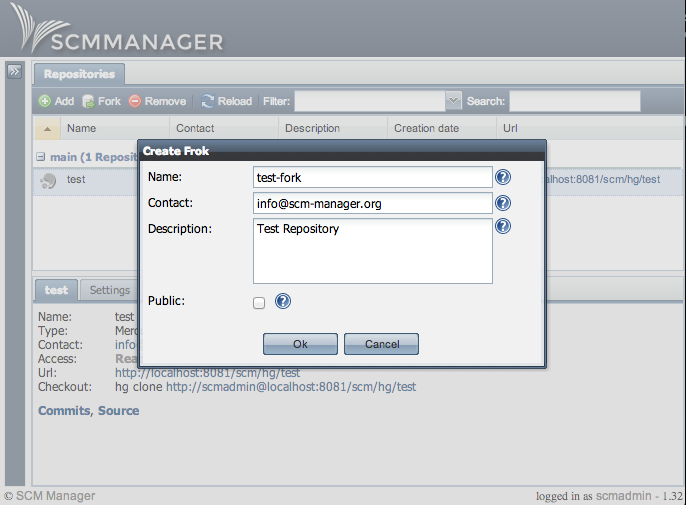

The new [scm-fork-plugin](https://bitbucket.org/sdorra/scm-fork-plugin) is now available over the scm-manager plugin center. It allows users to fork repositories. The plugin requires 1.32 or newer of scm-manager and depends on the [scm-userrepo-plugin](https://bitbucket.org/sdorra/scm-userrepo-plugin).

**Screenshots**

