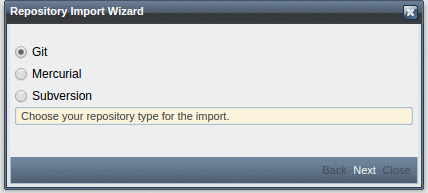

SCM-Manager 1.43 main feature is a new repository import wizard. This new wizard supports three import methods:

1.  Import repositories from the repository directory (.scm/repositories/type). This method is supported by git, mercurial and subversion.  
    
2.  Import repositories from a remote url. This method is supported by git and mercurial.  
    
3.  Import repositories from a bundle/dump (svndump). This method is supported by subversion.  
    

**Note:** Click on the images above to see the wizard in action.

