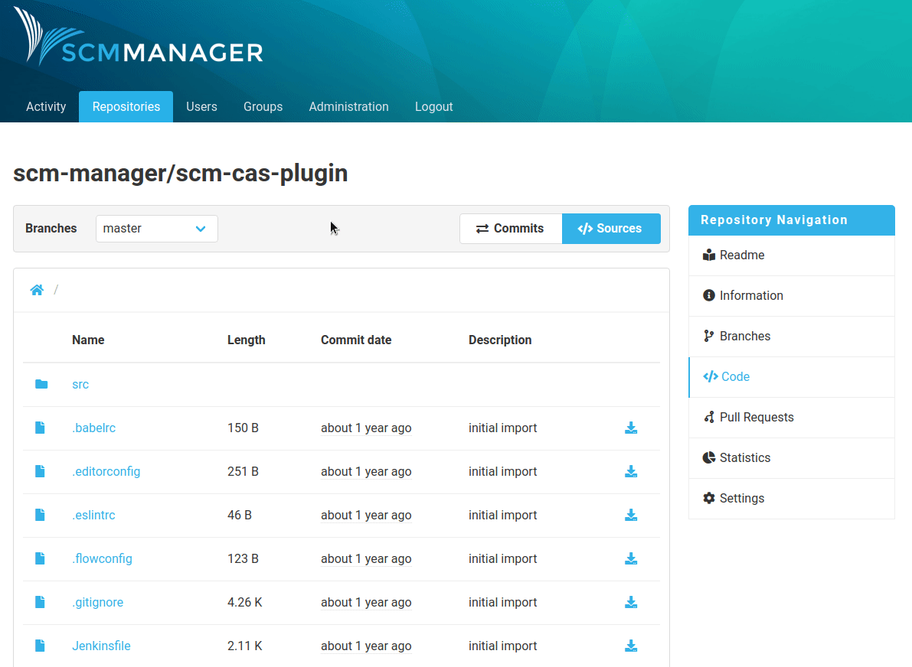
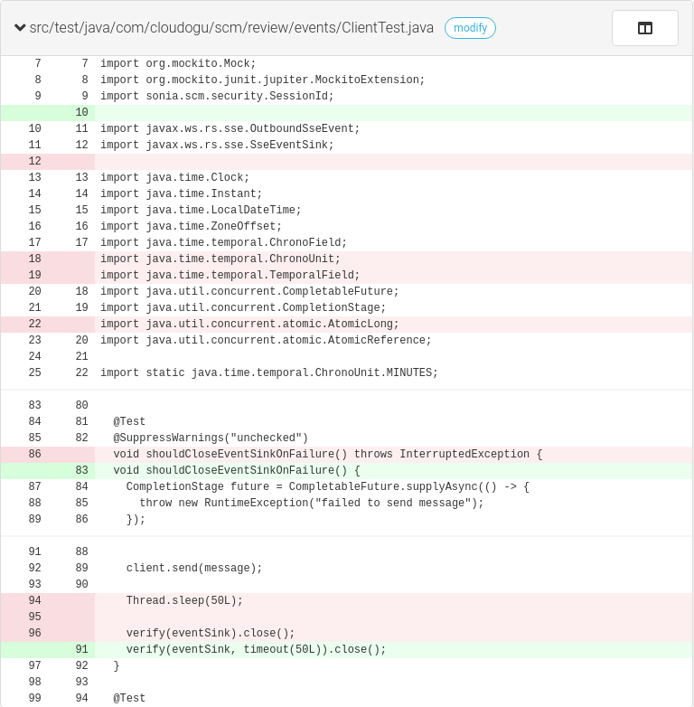
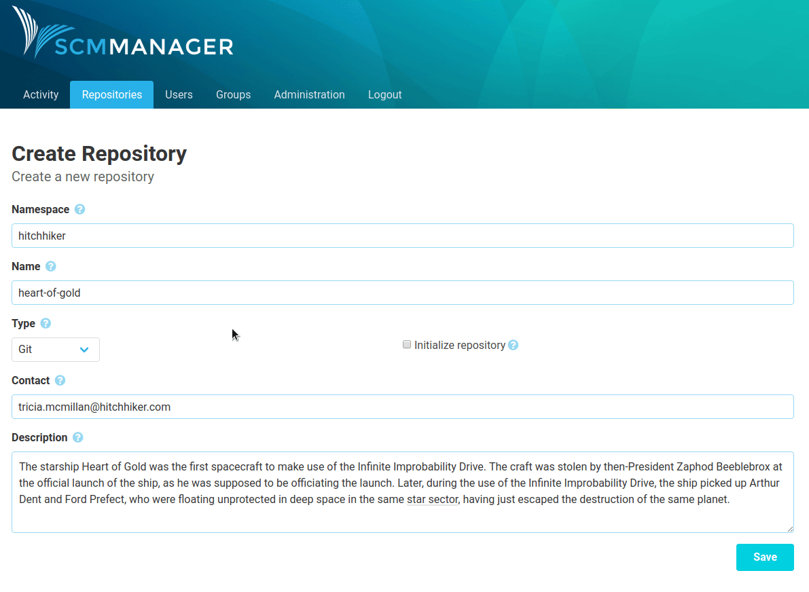

About six weeks ago we presented you the first release candidate of SCM-Manager 2. Now we finished the RC-2. Here are our favorite new features:

## Unification of source and commits become “code”

We got feedback that the navigation points “Commits” and “Sources” on the right side led to confusion, because the branch context was lost on navigating between those two. Therefore we joined them into the new “Code” view. Here you can switch between sources and commits without loosing the branch context.

## Code highlighting in diffs

As now we support syntax highlighting in diff views including pull requests. Below you can see screenshots from RC-1 (left) without syntax highlighting and from RC-2 (right) with syntax highlighting.

## Initialize Repositories

On repository creation you can now initialize your repository with an initial commit, which contains a readme with title and description of the repository.

  

## Markdown Preview

In the source view markdown files will be rendered by default. You can switch to source view with a toggle in the right upper corner.

  

## Changelog

### Added

- Set individual page title
- Copy on write
- A new repository can be initialized with a branch (for git and mercurial) and custom files (README.md on default)
- Plugins are validated directly after download
- Code highlighting in diffs
- Switch between rendered version and source view for Markdown files

### Changed

- Stop fetching commits when it takes too long
- Unification of source and commits become “code”

### Fixed

- Classloader leak which caused problems when restarting
- Failing git push does not lead to an GitAPIException
- Subversion revision 0 leads to error
- Create mock subject to satisfy legman
- Multiple versions of hibernate-validator caused problems when starting from plugins
- Page title is now set correctly
- Restart after migration

## How to get RC-2

Currently there are two ways to run SCM-Manager 2:

### Docker

To start SCM-Manager with a persistent volume on port 8080 run the following command:

`docker run -p 8080:8080 -v scm-home:/var/lib/scm --name scm scmmanager/scm-manager:2.0.0-rc2`

### Standalone Server

The standalone server requires an installed jre version 8. You can download the binaries here:

- [.tar.gz](https://maven.scm-manager.org/nexus/content/repositories/releases/sonia/scm/scm-server/2.0.0-rc2/scm-server-2.0.0-rc2-app.tar.gz) (sha1: eb5eccefcd34bea1bc7c054a9ba32a6ce664f278)
- [.zip](https://maven.scm-manager.org/nexus/content/repositories/releases/sonia/scm/scm-server/2.0.0-rc2/scm-server-2.0.0-rc2-app.zip) (sha1: 00dacaee4ecd817238c45f2e9e271bcc933cc056)

Extract the downloaded archive and start `scm-server/bin/scm-server` or `scm-server\bin\scm-server.bat`. Your scm-manager should now be running on port 8080.

## Give feedback

If you run into problems or you want to give us feedback for the new version, feel free to contact us using the [mailing list](https://groups.google.com/forum/#!forum/scmmanager) ([scmmanager@googlegroups.com](mailto:scmmanager@googlegroups.com)).

