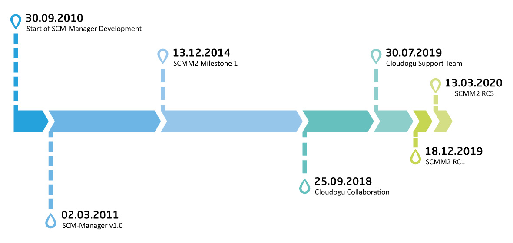

In Fall 2018 Cloudogu and I announced a [cooperation](https://www.scm-manager.org/scm-manager-2/scm-manager-2-gets-a-boost-by-cloudogu-gmbh/) for this project. Ever since then, a lot has changed in the background. We established a permanent SCM-Manager team at Cloudogu, which I am the leader of. That allowed us to pick up speed in the development of SCM-Manager and to take care of support cases at the same time. Thanks to that the release of SCM-Manager 2.0 is closer than ever. SCM-Manager has come a long way, and I can't wait for implementing all these great ideas that we still have.

Since almost all the development capacity for SCM-Manager comes from Cloudogu, it's only fair that the company is the official owner of the project. Therefore, we agreed to make the change. A few days ago, I handed over the project to Cloudogu.

## What does that mean for you?

By handing over SCM-Manager to [Cloudogu](https://cloudogu.com) we hope to continue on the prosperous path that we have been on for more than two years now. There are still many ideas and plans that we, Cloudogu and I, want to bring to live, to make SCM-Manager even more user friendly, versatile and reliable.

Everything will continue the way it has for the last couple of years: SCM-Manager is still a community Open Source project where everyone is invited to contribute ideas and feedback. The only thing that has already changed is that SCM-Manager is now licensed under the MIT license, but that should practically have no consequences, because the MIT license is even less restrictive than previously used BSD 3-clause license.

I'm looking forward to continuing the work on SCM-Manager, discussing your feedback and ideas and implementing new features.
