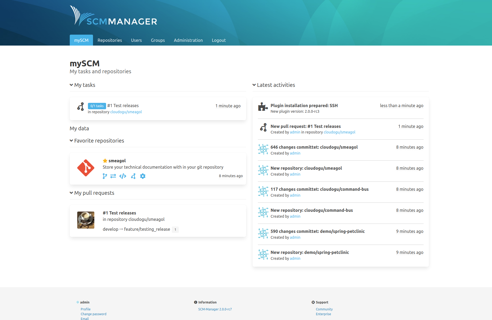

Hey there, another two weeks have passed (can you see the pattern?), and we proudly present release candidate 7 of SCM-Manager 2 to you. Besides a fix regarding repository write requests with anonymous access enabled and other small bugs, we have a new nice plugin for you: A new landing page. We call it **mySCM**. If you install this new plugin, you can see all these things at a glance:

* your favorite repositories
* latest events regarding repositories
* events and pending updates from the plugin center
* your open pull requests
* your tasks regarding pull requests

The last two of course only with the review plugin. Expect more things here, like for example your latest build results, because this page is easily extendable by plugins.

We think it’s nice and would love to hear your opinion on that.

You can download the RC-7 here

* [.tar.gz](https://maven.scm-manager.org/nexus/service/local/repositories/releases/content/sonia/scm/scm-server/2.0.0-rc7/scm-server-2.0.0-rc7-app.tar.gz) (sha1: f10fa85757f952592af40cb4856d92787fd83ed1)
* [.zip](https://maven.scm-manager.org/nexus/service/local/repositories/releases/content/sonia/scm/scm-server/2.0.0-rc7/scm-server-2.0.0-rc7-app.zip) (sha1: 8a297dc00caec4b7497605b8c0da64dbe68a5b06)

or use it via Docker

`docker run -p 8080:8080 -v scm-home:/var/lib/scm --name scm scmmanager/scm-manager:2.0.0-rc7`
