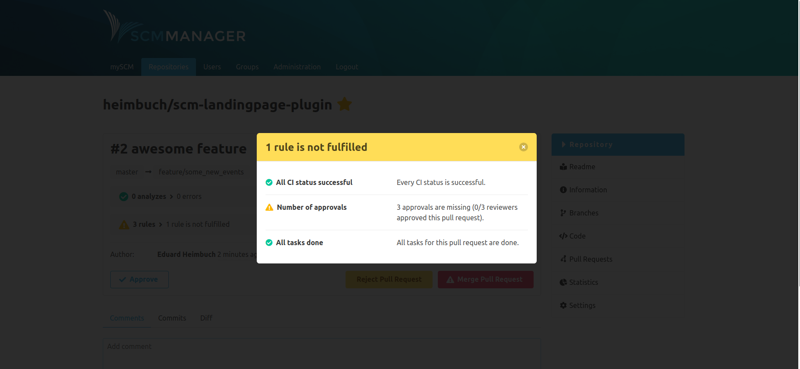

Hey folks,

It’s been a month since our last release and today you get our newest version with some new features. Unfortunately, it is another release candidate, but we are optimistic that our final 2.0.0 release will be out soon.

The biggest change of this release candidate is the new workflow engine, which allows you to set validation rules for pull requests with the SCM-Review-Plugin. This way, you can enforce a certain workflow for merging a pull request.

The following rules can be configured with the workflow engine:

* All reviewers have approved
* At least x reviewers have approved
* All CI status’ have to be successful (Example: All Jenkins builds have to be green)
* There has to be at least x successful CI status’
* All CI status’ of one type have to be successful
* All tasks existing for this pull request are done

The status of the configured rules is shown in your pull request.

Some other changes we made are a new cipher which is compatible with Java 12 and above. SCM-Manager instances using the old cipher will be fully supported though. We have also introduced a new “@Requires” annotation for optional dependencies. This is especially useful if you want bind plugin features only if the dependent plugin is also installed.

As usual, you can find all changes for this version in our changelog. Feel free to leave us some comments.

You can download the RC-8 here

* [.tar.gz](https://maven.scm-manager.org/nexus/service/local/repositories/releases/content/sonia/scm/scm-server/2.0.0-rc8/scm-server-2.0.0-rc8-app.tar.gz) (sha1: 8bf465525d5a8c5907d1f74096af1783bc0b2fa7)
* [.zip](https://maven.scm-manager.org/nexus/service/local/repositories/releases/content/sonia/scm/scm-server/2.0.0-rc8/scm-server-2.0.0-rc8-app.zip) (sha1: f688a9dbee45f11334fafd82f72b3636f6ad58f6)

or use it via Docker

`docker run -p 8080:8080 -v scm-home:/var/lib/scm --name scm scmmanager/scm-manager:2.0.0-rc8`
