Good news, we made it. Before running out of numbers for our release candidates, we finally released version 2.0.0 of SCM-Manager. 

It took us nearly 10 years, over 10,000 commits and 8 release candidates.

# What’s new?

To be honest, more than we can explain in a single post. So in the next chapters we want to give you an overview of the most important topics. There are a lot of blog posts and documents to come.

What has **not** changed are the reliable foundations, the easy installation process, the minimal maintenance, and the extensibility to match your specific needs.

But now, allow us to proudly present to you, what we at [Cloudogu](https://cloudogu.com/) build for you in the last years.

## Frontend

The most obvious change is the new user interface. We recreated the whole UI from scratch. The 1.x UI was based on ExtJS, which worked great, but its look is somewhat outdated. With ExtJS it was possible to override any UI element from a plugin. This is great in terms of extensibility, but not really maintainable if you want to evolve the core. The new frontend stack is entirely based on [React](https://reactjs.org/) and [Bulma](https://bulma.io/) and it has well-defined extension points, which makes the whole site easier to maintain.

Enough about the technical background, here are some screenshots of the new UI:

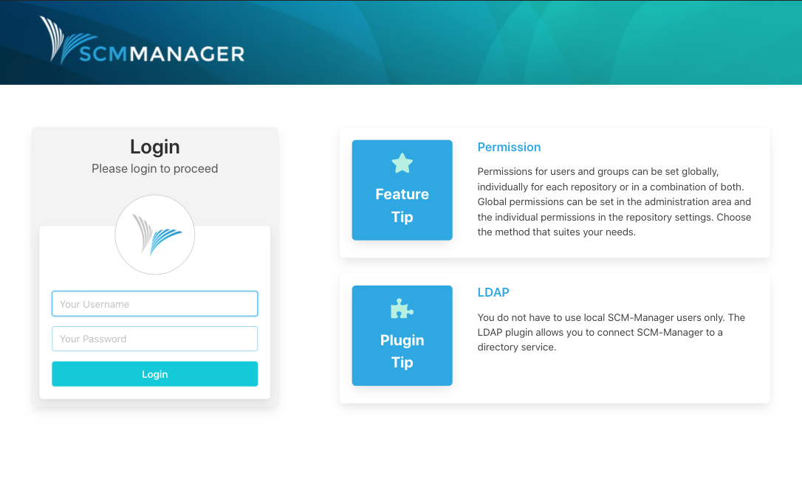
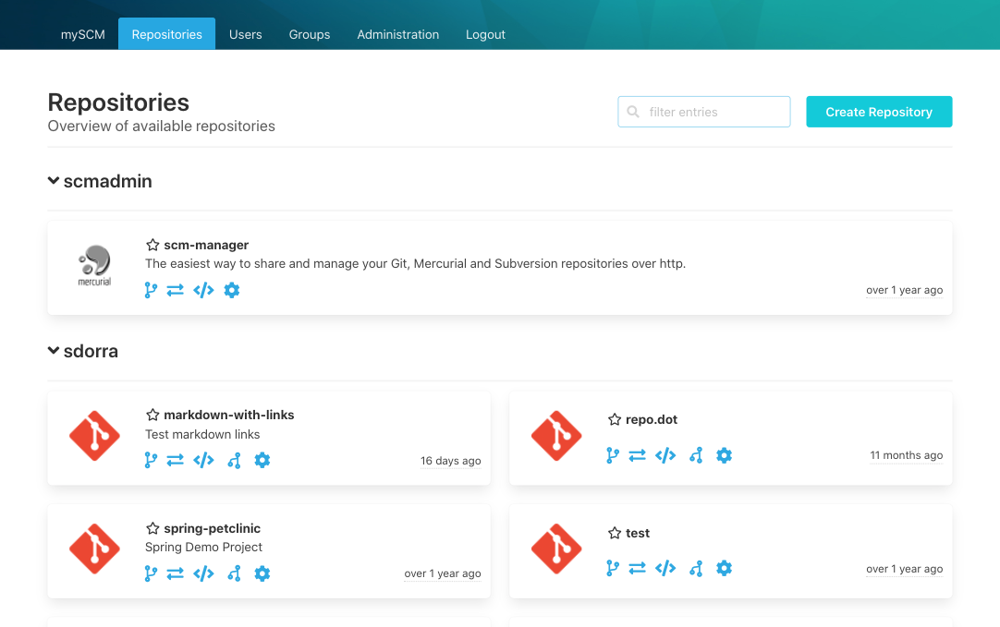
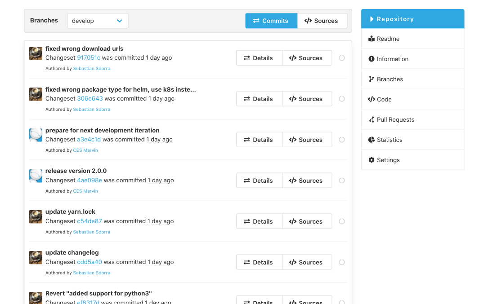

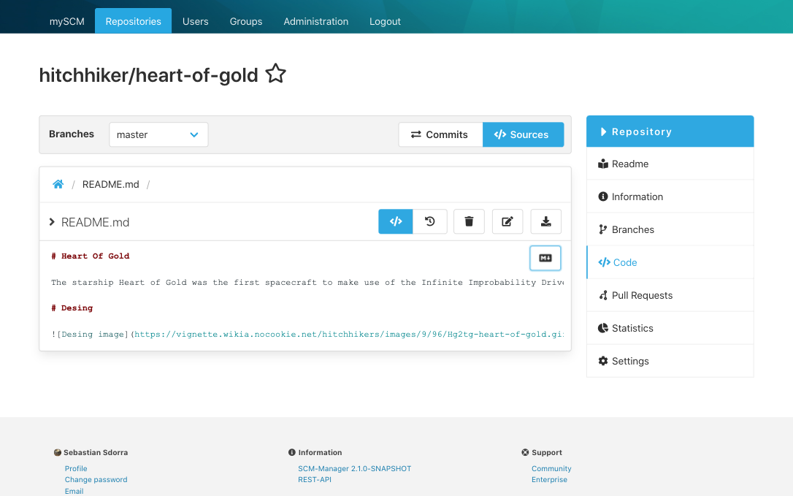
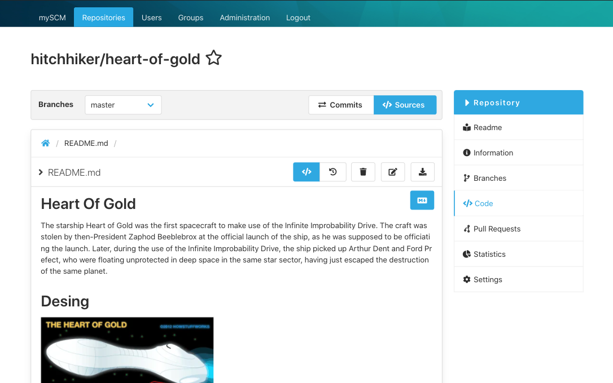
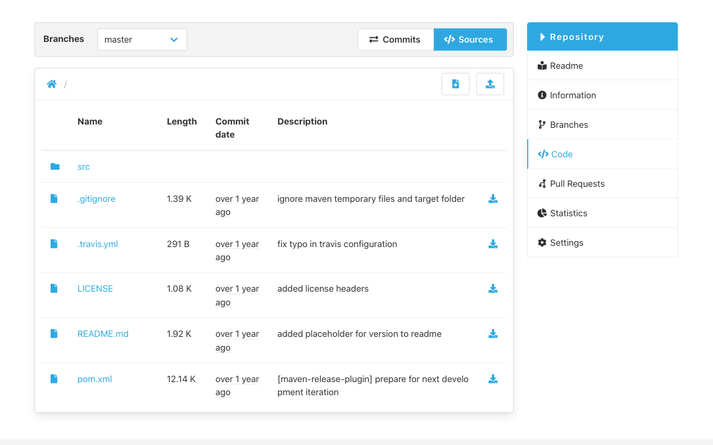

## Plugins

We created a whole new package format for the plugins, which should fix all the problems with v1 plugin installations. With the new format, only a single file has to be fetched, and the server can restart on its own.

We migrated [25 well-known plugins](https://www.scm-manager.org/plugins/) available for v1 (like jenkins, redmine, jira, ldap, cas, branch-wp, and so on), but more than this we have great new plugins for you:

### Review Plugin

With the [review plugin](https://www.scm-manager.org/plugins/scm-review-plugin/) you can implement a branch based peer review process: Develop new features on a branch, create a pull request where you describe your changes, and let a peer developer inspect these changes. You can write comments for the whole pull request, for single files and even for changed lines. Finally, you can merge the branches inside of SCM-Manager. With the help of the [CI plugin](https://www.scm-manager.org/plugins/scm-ci-plugin) you can enforce complex workflows, for example to ensure, that Jenkins builds have been run successfully and only working code will be incorporated.

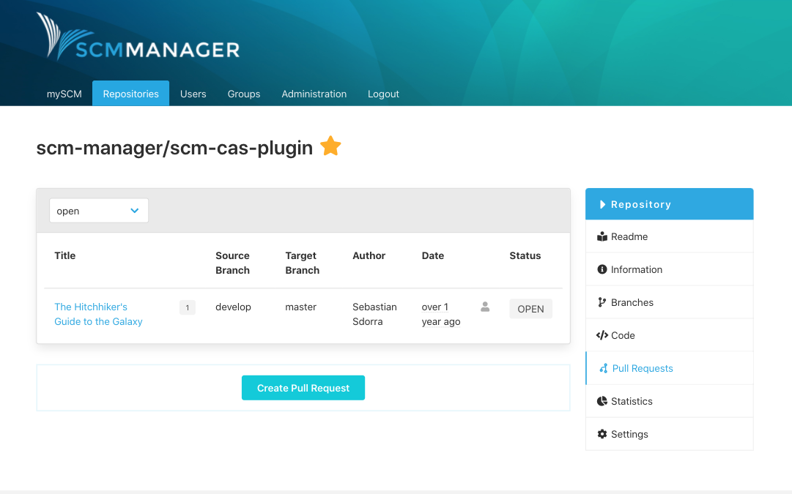
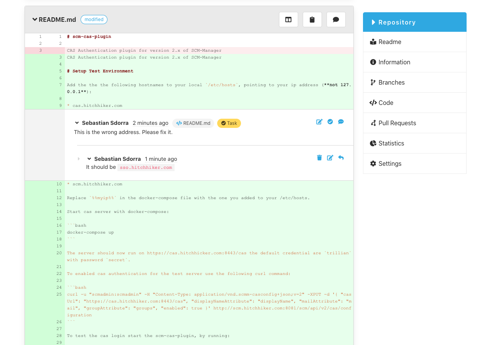

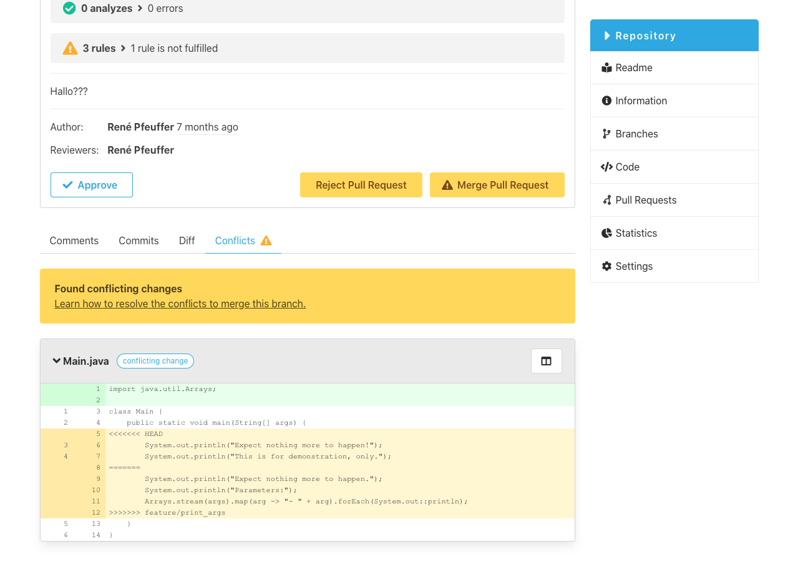

### Editor Plugin

Ever wanted to make a small change in a repository? Like updating a README (which by the way can be displayed by the [readme plugin](https://www.scm-manager.org/plugins/scm-readme-plugin)) or uploading a new file? Now you can use the [editor plugin](https://www.scm-manager.org/plugins/scm-editor-plugin) to do so.

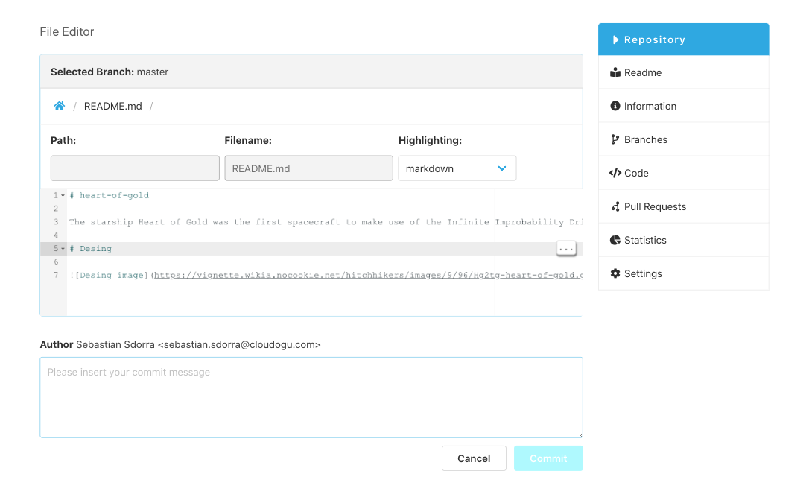

### SSH Plugin

You are done with constantly entering your username and password? No problem, use the [ssh plugin](https://www.scm-manager.org/plugins/scm-ssh-plugin) with an ssh key.

### Landingpage Plugin (MySCM)

Sometimes it gets hard to keep track of important things. This is, where our new [landingpage plugin](https://www.scm-manager.org/plugins/scm-landingpage-plugin) comes into play: On a single page you can see your tasks, the latest events and relevant data like your favorite repositories.

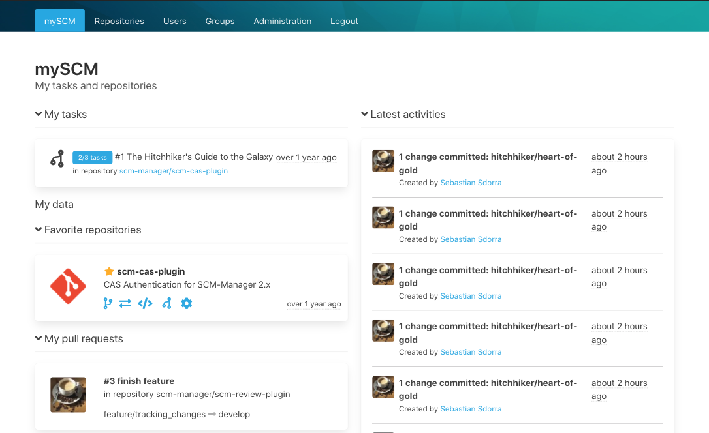

### OpenAPI Plugin

We are somewhat proud of the new [level 3 REST API](https://martinfowler.com/articles/richardsonMaturityModel.html), and we would like to enable you to use it. Instead of writing a big documentation we give you an [open API plugin](https://www.scm-manager.org/plugins/scm-openapi-plugin) to explore all the possibilities interactively.

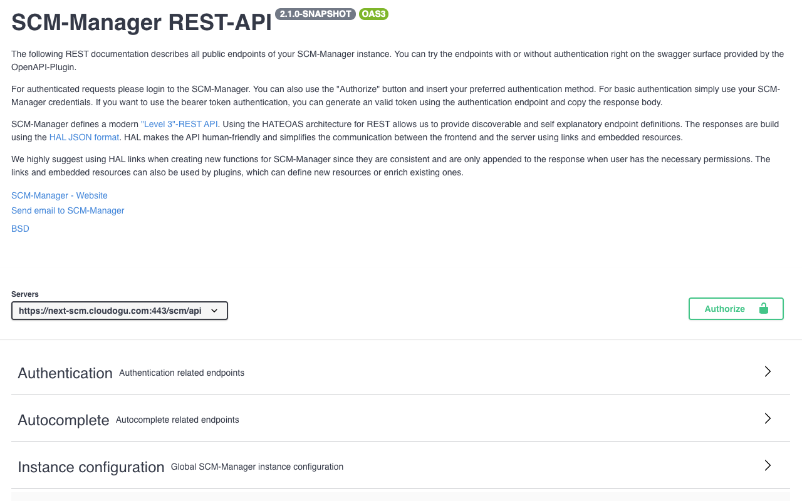

## Permissions

The permission model of SCM-Manager v1 was limited to the distinction between admins and users and it only used roles you could assign for single repositories. With version 2 you can now assign fine grained permissions, both globally and repository specific. But this definitely is a topic for another document.

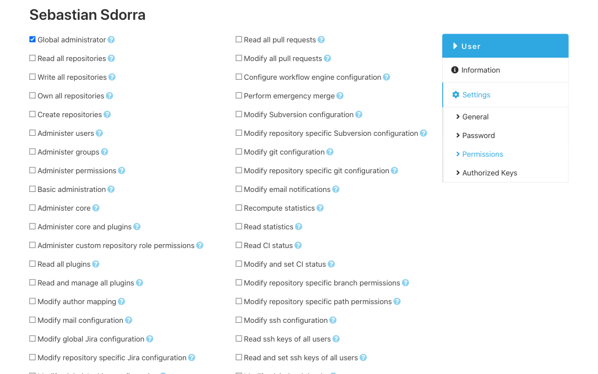

## Repository URLS

One of the most annoying things in v1 is the fact, that the urls for the repository ui and the one for the checkout/clone are different. With SCM-Manager 2 we wanted to change this. In order to fix this problem, we had to introduce a limitation for the repository names. In v1 it was possible to create repositories with any depth (a/b/c). This makes it really hard to add an ui to the same path, because it is nearly impossible to differentiate between the name of the repository and technical routes. So we decided to introduce namespaces. In SCM-Manager 2, a repository identifier consists of two parts: the namespace and the name of the repository. The namespace can be auto generated with a strategy (e.g. current username, year, repository type) or can be chosen freely.

This change fixes the routing problem and removes the technical ids from the urls (which were nearly omnipresent in v1). For your convenience, we tried to create redirects from the old urls to the new ones if you migrate from v1 to v2.

## Versioning

You may have noticed a little detail in our new version number: We moved from 1.60 to 2.0.0, that is, from now on we use [semantic versioning](https://semver.org/).

## Getting started

Want to get it right now? Head over to our new download page. You have the choice:

* Docker
* Kubernetes
* Debian/Ubuntu
* Red Hat/CentOS/Fedora
* Generic Linux
* Windows

There is no excuse to not getting started today.

If you want to migrate from v1, please have a look at the [migration instructions](/docs/2.0.x/en/migrate-scm-manager-from-v1/).
