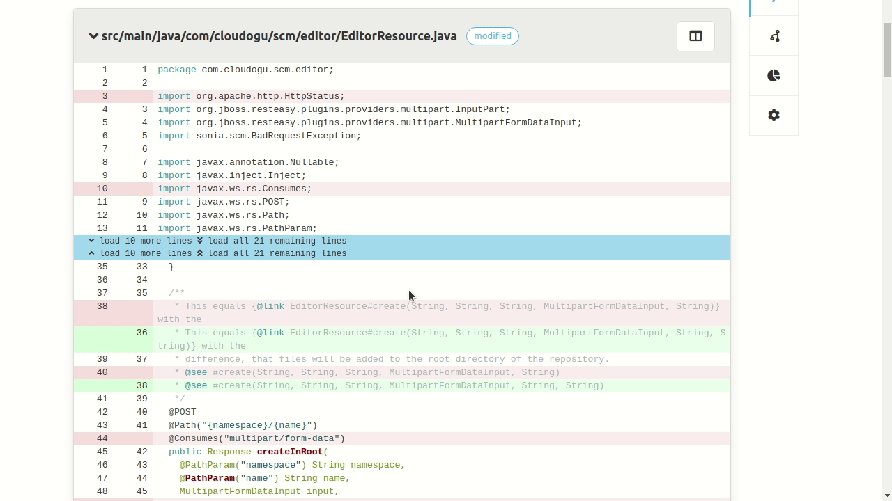
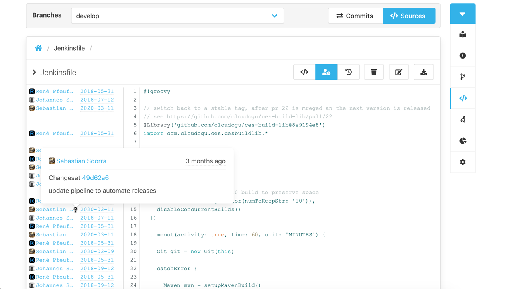
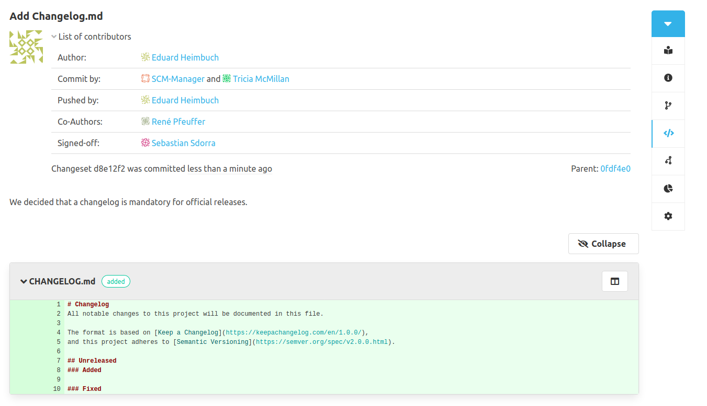

With the release of 2.0.0 we did not stop. We just took a deep breath and continued doing what we love most. So here it is, version 2.1.0 of SCM-Manager, bringing to you some really nice new features.

## New Features

### Expandable Diff
It is now possible to expand the gaps between the so-called “hunks” in file diffs. So whenever you wondered where this closing bracket came from or how a chapter ends, you now don’t have to navigate to the original file.

### Annotate / Blame

With the new annotate feature you now can see for each line of a file, who changed the line and when it was changed the last time. If you move over the annotation you can get even more information, including a link to the changeset.

### Contributors

We improved the changeset details view. As you can see in the screenshot, all contributors of the changeset are shown grouped by their role. By now the contributors are getting detected from git trailers, git committer and may be expanded by plugins, e.g. [Pushlog Plugin](/plugins/scm-pushlog-plugin).

### End User Documentation

As a start we managed to create a bunch of user oriented documentation for the core of SCM-Manager (e.g. for [administration](/docs/2.1.x/en/user/admin/settings/)) as well as for many plugins (e.g. for the [review plugin](/plugins/scm-review-plugin/docs/2.1.x/en/overview/)).

## Lots of fixes
All of our work would be meaningless without users, and that is without you. We are grateful about the amount of feedback we receive. An important part of the feedback are error reports. In this release we were able to fix most of your reported issues. You are a great community. Please keep up with this.

Some of the fixes include an updated mercurial library to support newer versions of hg, a fix in the migration process when you used custom repository locations for your SCM-Manager v1, some UI fixes, and more. Have a look at the [changelog](/download/2.1.0#changelog) for more information.
