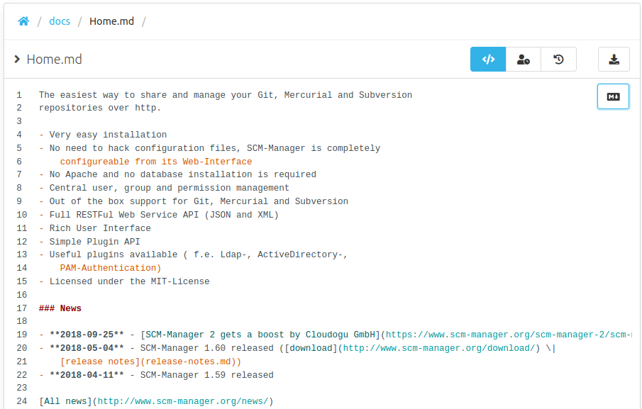

With this new release we improved the general stability of SCM-Manager as we fixed some minor bugs. Also the documentation was updated on several topics like the [SSL configuration](https://www.scm-manager.org/docs/2.3.x/en/administration/scm-server/) or the [Reverse proxy configuration](https://www.scm-manager.org/docs/2.3.x/en/administration/reverse-proxies/).

It may seem obvious but we decided to show line numbers on most code viewers/editors. Feel free to leave us some thoughts about the changes or drop us a hint what you would love to see next. 

We are already working on some new major features. Stay excited for the next versions.

