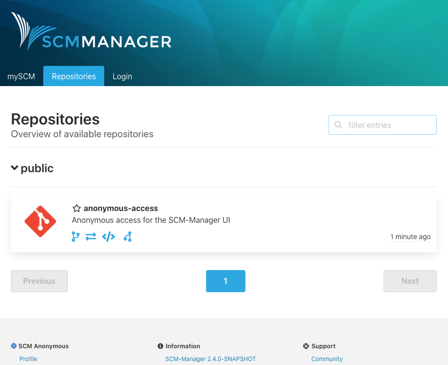
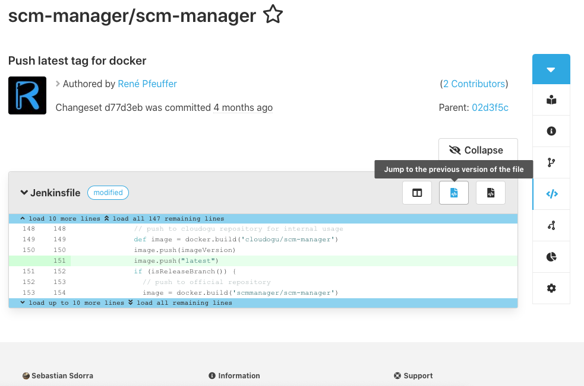
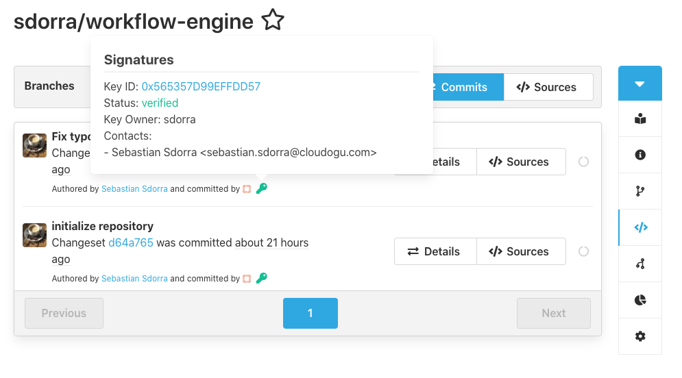

Today we are releasing the next minor version of the SCM-Manager with a number of exciting new features that we want to share in this blog post with you.

## Full anonymous access

It is now possible to allow unauthenticated users to access parts of the SCM-Manager web interface (it was previously already possible for the api). 
The anonymous mode can be activated globally, either for ui and/or api.
A new `_anonymous` user can then be granted permissions on a global or repository level, just like any other user.

## Jumping to source code from diff

New button links to the source code are now available in the diff view of all commits, merges and pull request.
This eases the review process by reducing the number of clicks a reviewer has to make to get to the file before and after a proposed change.

## Full support for gpg signatures

Whenever a commit is made through the web interface of SCM-Manager for the first time, a new gpg key-pair is generated for the active users which is automatically
used to sign any subsequent changes. Custom public keys can also be managed through a new administration page. Commit signatures and their status are displayed as a key icon
directly next to the change.

## Closing words
For the full changelog please visit the [download page](/download/2.4.0/#changelog).
