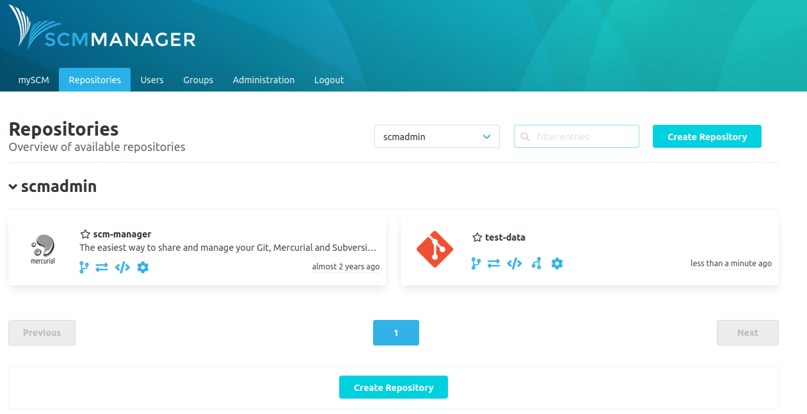
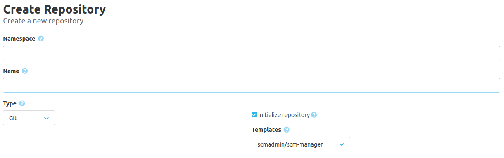

Hey,

we improved the general usability and workflow by adding some new features which you may checkout with this release.

You can now filter your repositories by namespace.

Also we created a new [plugin](https://www.scm-manager.org/plugins/scm-repository-template-plugin/) which can improve your workflow by creating template repositories. A template repository is defined by adding a [template definition file](https://www.scm-manager.org/plugins/scm-repository-template-plugin/docs/1.0.x/en/usage/). Right after you may use your template to initialize new repositories.

Feel free to check out the new features and leave us a comment.
