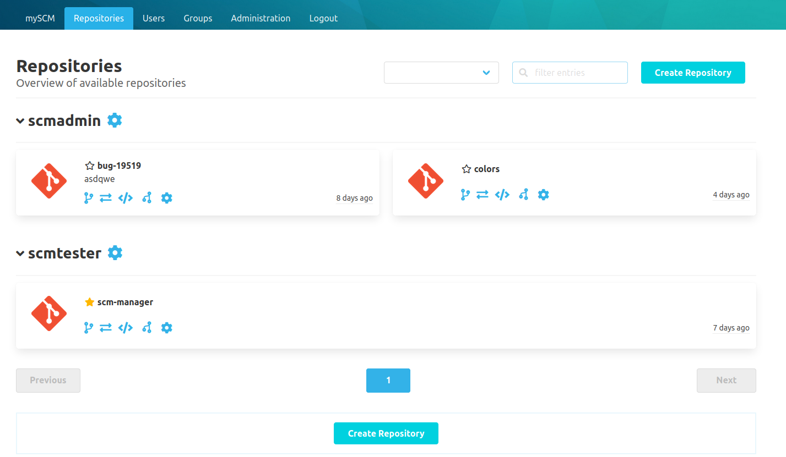
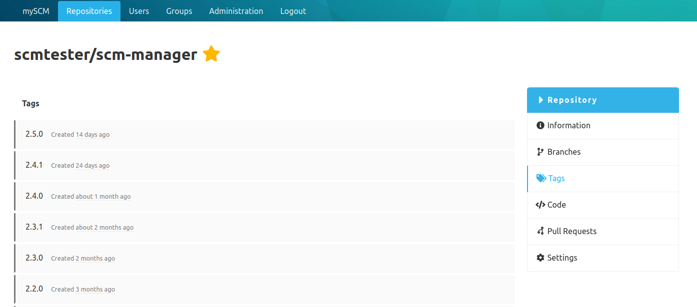
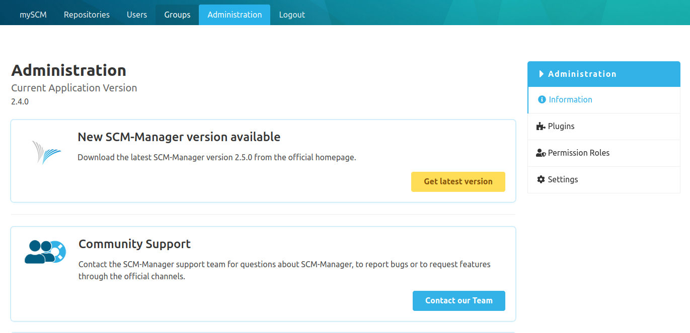
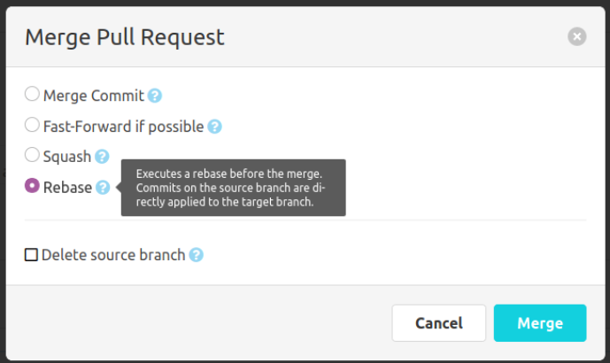

Hello SCM-Manager community,

some time has passed and we created some new features.

## Namespace Permissions
Recently we added the possibility to filter your namespaces. 
Now we went one step further: you can manage your repository permissions on namespace-level. 
Just click on the blue gear icon and find the namespace permission settings.

## Tags overview
If you missed it already it is finally here. The list of tags is now shown on your repository.

## Latest release information
To keep your SCM-Manager up-to-date you will be informed about the latest release on the admin information page.

## Merge with Rebase
The Review-Plugin already could merge your pull requests with different strategies like merge commit, fast-forward if possible and squash. 
Now we added the merge with rebase to keep your history nice and clean.

## SSH Access Token Command
Also we added a new command in the SSH-Plugin which returns a valid access token with user permissions when called. 
This access token can be used for rest api calls.

Have some questions or suggestions for SCM-Manager? Connect directly to the DEV-Team on [GitHub](https://github.com/scm-manager/scm-manager/) or [our Support channels](https://www.scm-manager.org/support/).
