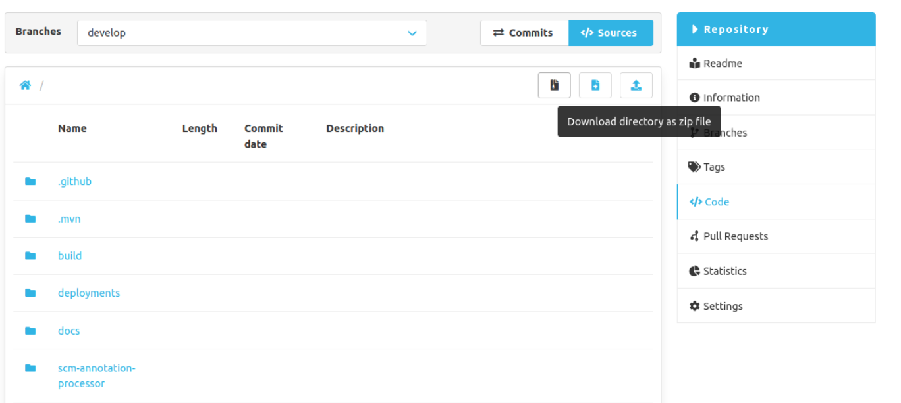
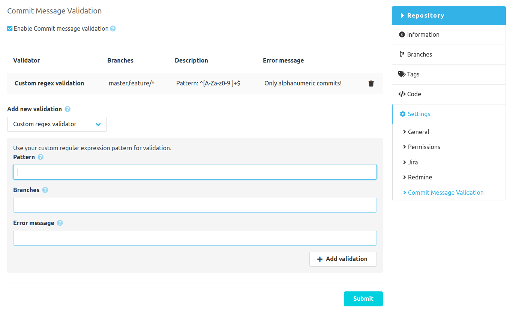
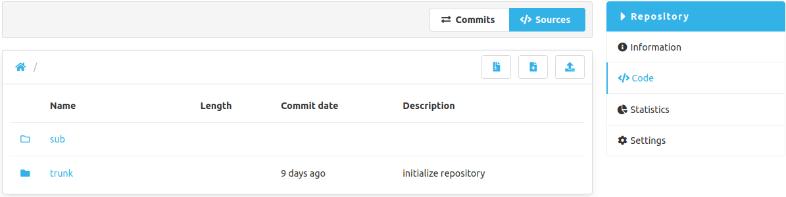

Hello SCM-Manager community,

time flies and three months have passed already since we released the community edition of SCM-Manager 2. 
Thenceforth we give our very best to bring you new features and new plugins regularly and make the SCM-Manager your favorite Repository-Management-Tool.
We hope you will like the changes and enhancements we made.

## Personal API Keys
We added the concept of API keys to SCM-Manager. Each user may generate API keys based on his own permissions. 
An API key will be stored encrypted in the SCM-Manager and works like a password. It can be used for REST API calls and even for the SCM-Protocols like git.
If you don't want that the API key have all your permissions you may limit them by selecting a permission role like `READ`, `WRITE` or `OWNER` on creation.

## SCM-Archive-Plugin
We migrated the [SCM-Archive-Plugin](https://www.scm-manager.org/plugins/scm-archive-plugin/) which already exists for SCM-Manager 1. 
You may download your sources from a repository as a zip file. Just select your directory and click on the archive button.

## SCM-Commit-Message-Checker-Plugin
And we also created an entirely new plugin for you which may not amuse your developers. 
The `Custom RegEx Validator` from the [Commit-Message-Checker-Plugin]((https://www.scm-manager.org/plugins/scm-commit-message-checker-plugin/)) will protect your selected branches and ensure all commits pushed to the SCM-Manager fulfill your requirements.
Example: Every commit pushed to your main branch has to contain an issue id from your project management system.

## Submodules
In SCM-Manager 1 we already supported submodules for Git, Mercurial and Subversion. Unfortunately on our big rebuild for SCM-Manager 2 this feature got disabled. 
We enabled submodules again and now your nested repositories are linked in the source view of the parent repository.

As always stay excited for the next big features which we are currently working on.

Have some questions or suggestions for SCM-Manager? Connect directly to the DEV-Team on [GitHub](https://github.com/scm-manager/scm-manager/) or [our Support channels](https://www.scm-manager.org/support/).
