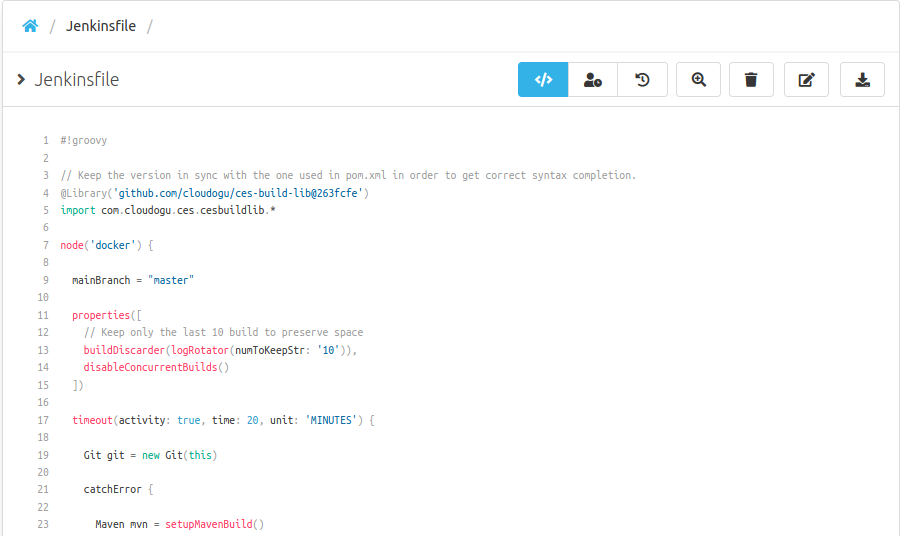
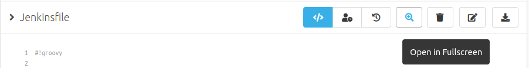
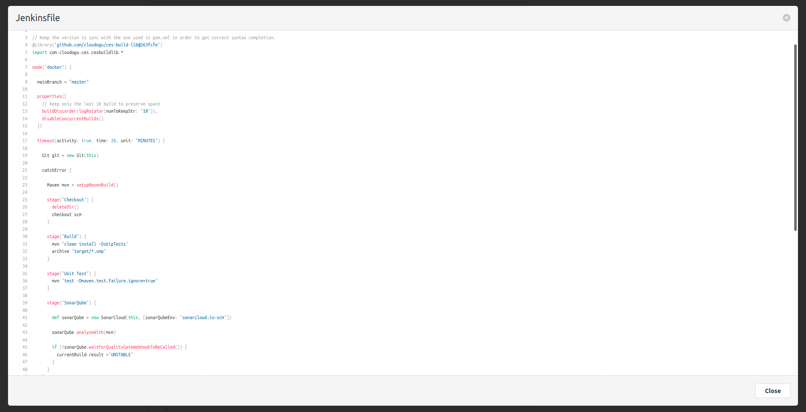

Hello SCM-Manager community,

in the recent releases we provided some comprehensive features to improve your experience using SCM-Manager. 
This time we took a step back and worked on our general code base.

## Syntax Highlighting
SCM-Manager provides several code editors and code viewers which already support syntax highlighting. 
We managed to unify the syntax highlighter formatting. The color changes are particularly noticeable.
Working on this we also reduced the size of the frontend bundles which will improve your overall frontend performance.

## Fullscreen Mode
One new feature is the fullscreen mode. This should be pretty self-explanatory.

See your file content or diff in fullscreen mode.

## General improvements and fixes
As mentioned, a lot of our focus went on general improvements and bugfixes. Some of them are:
- The email address is no longer required for user (frontend validation changed).
- We fixed the syntax highlighting for the programming language go.
- SCM-Manager plugins can now expose ui components to be shared with other plugins.

Are you still missing an important feature? How can SCM-Manager help you to improve your work processes? We would love to hear you most needed features!

Have some questions or suggestions for SCM-Manager? Connect directly to the DEV-Team on [GitHub](https://github.com/scm-manager/scm-manager/) or [our Support channels](https://www.scm-manager.org/support/).
