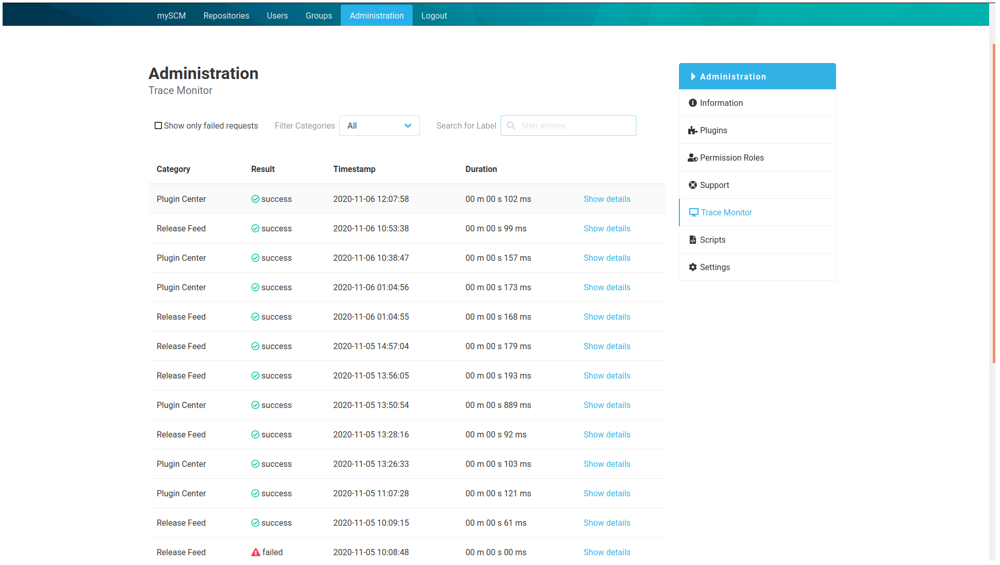
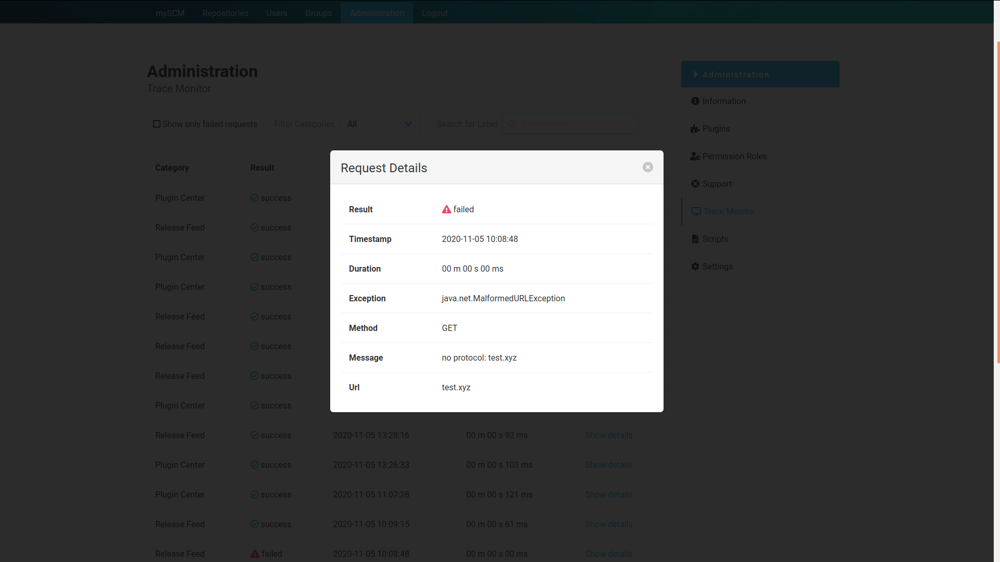
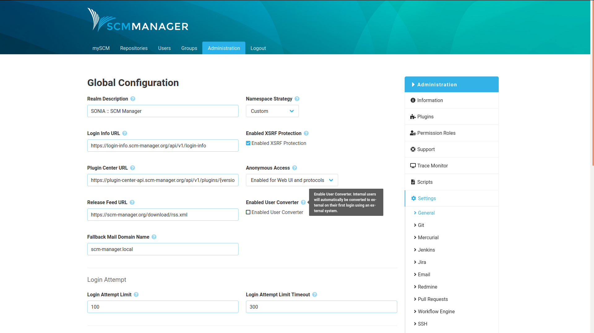
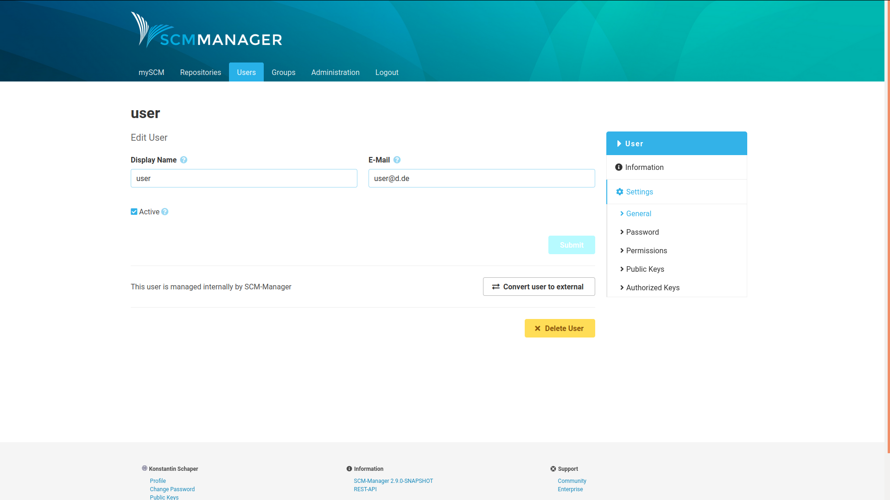
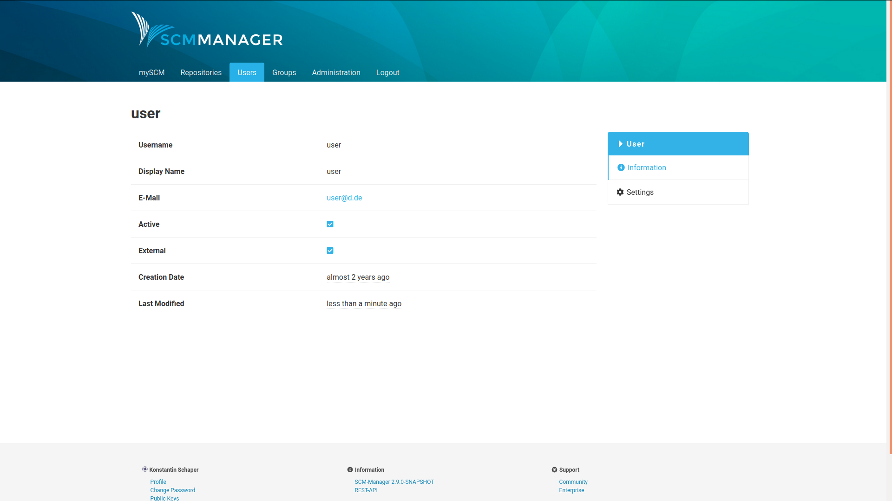
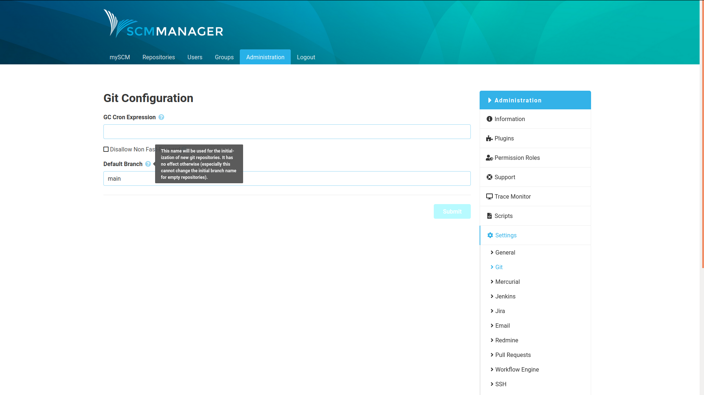

Dear SCM-Manager community,

in today's release we extend debugging capabilities, improve integration with external 
authentication systems and make a step towards a more inclusive and neutral codebase by giving you
the option to name your default branch for git. We set the default to `main` (previously `master`).
We hope this encourages our users to also evaluate their own codebases.

## Trace API

Debugging is an important task and a good debugging system helps users and developers to pinpoint
potential issues quicker and save time in the process. Because of that, we introduced 
a new tracing api that captures internal and external requests and gives you a neat
visual representation of what is happening on the server. 

The table can be sorted and filtered and details for dedicated requests can be
retrieved for further inspection.

We currently implemented the core api and base functionality, 
but plan to extend this to include more detail and further catogries by
integrating it into our plugin ecosystem.

## User Converter

We introduced a new system in this release which allows you to enable a user converter that, as
the name suggests, automatically converts users that have been created through the SCM-Manager UI (internal)
to external users when they login through a third-party authentication system such as LDAP or CAS.

You can also convert users manually back and forth.

The current state is displayed on the user.

External users do not have a password and can therefore not log in through SCM-Manager directly.

When a user is converted to an internal user, you have to provide a password, so the user can log in again.

## Default Branch Setting

It is now possible to define the default branch for all new repositories in the administration settings.
This does not affect already existing branches, but should give you flexibility when migrating away from the
obsolete `master` default. Please note that this only works, when you initialize your new repository.

## General improvements and fixes
We have also fixed a series of nasty bugs that some of you might have experienced:
- Cloning mercurial repositories with api keys does no longer lead to an unauthorized error even if permissions are set correctly
- The option for cloning repositories via ssh for anonymous users is no longer visible in the ui as it is not possible anyways
- You can now download public files through the rest api as an anonymous user with additional clients such as curl or postman

Are you still missing an important feature? How can SCM-Manager help you to improve your work processes? We would love to hear you most needed features!

Have some questions or suggestions for SCM-Manager? Connect directly to the DEV-Team on [GitHub](https://github.com/scm-manager/scm-manager/) or [our Support channels](https://www.scm-manager.org/support/).
