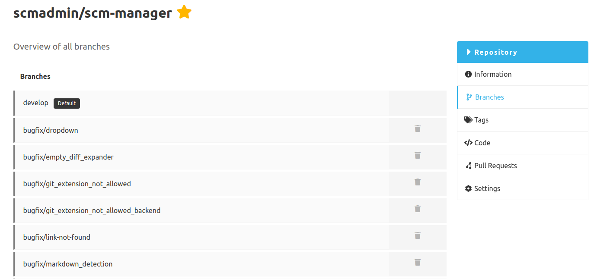
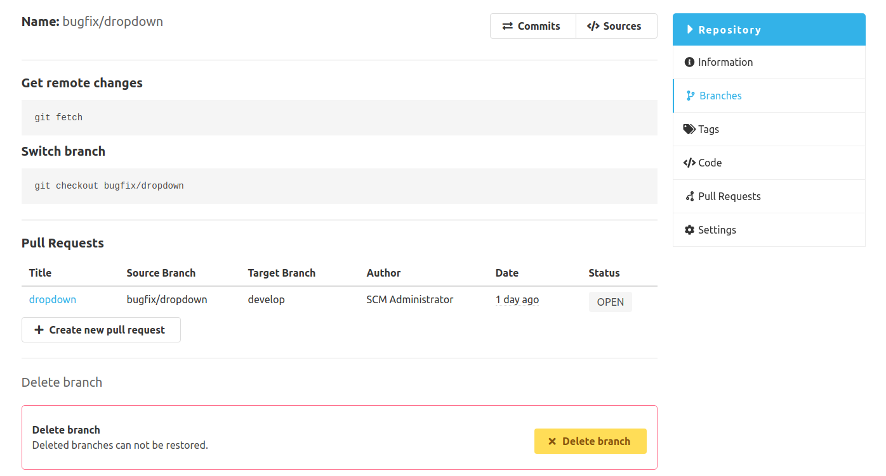
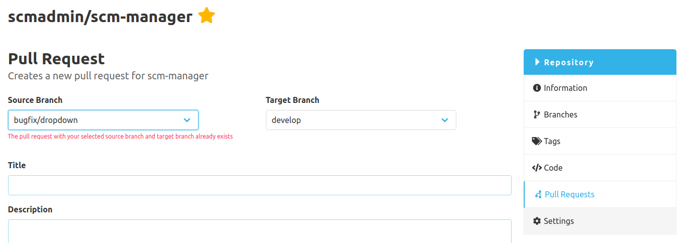
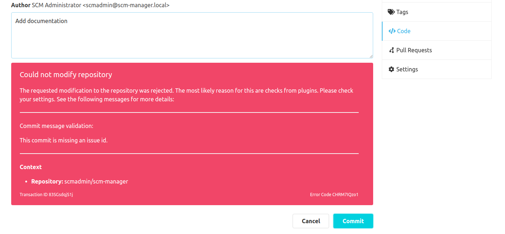

Dear SCM-Manager community,

our latest minor release is out now. Recently we released some new useful plugins for you which can improve your SCM-Manager experience.
However we are also working on the SCM-Manager and adding more and more missing features.

## Delete Branches

You can finally delete your branches via the UI. Keep in mind that deleted branches cannot be restored from the SCM-Manager.

## Pull Request Validation
Using the [SCM-Review-Plugin](https://www.scm-manager.org/plugins/scm-review-plugin/) the SCM-Manager supports working with pull requests.
We improved the validation and performance for the creation of new pull requests. 
Now you will be immediately informed if your selected branches for your new pull request are invalid.

## REST API Documentation

With the [SCM-OpenAPI-Plugin](https://www.scm-manager.org/plugins/scm-openapi-plugin) 
the SCM-Manager provides an easy-to-use REST API documentation integrated with Swagger.
Unfortunately this automatic generated documentation wasn't as understandable as we expected. 
So we improved the endpoint descriptions and added some examples for the usage of our core API. 

## Improved Error Messages

Working with SCM-Manager you can limit access to repositories and enforce workflows using various plugins. If you do so, it is likely you may encounter some errors, 
for example when your commits were rejected because they do not fulfill the requirements which were defined using the [SCM-Commit-Message-Checker-Plugin](https://www.scm-manager.org/plugins/scm-commit-message-checker-plugin/).
In these cases we want to show you the exact reason why a error occured.

Are you still missing an important feature? How can SCM-Manager help you to improve your work processes? We would love to hear you most needed features!

Have some questions or suggestions for SCM-Manager? Connect directly to the DEV-Team on [GitHub](https://github.com/scm-manager/scm-manager/) or [our Support channels](https://www.scm-manager.org/support/).
