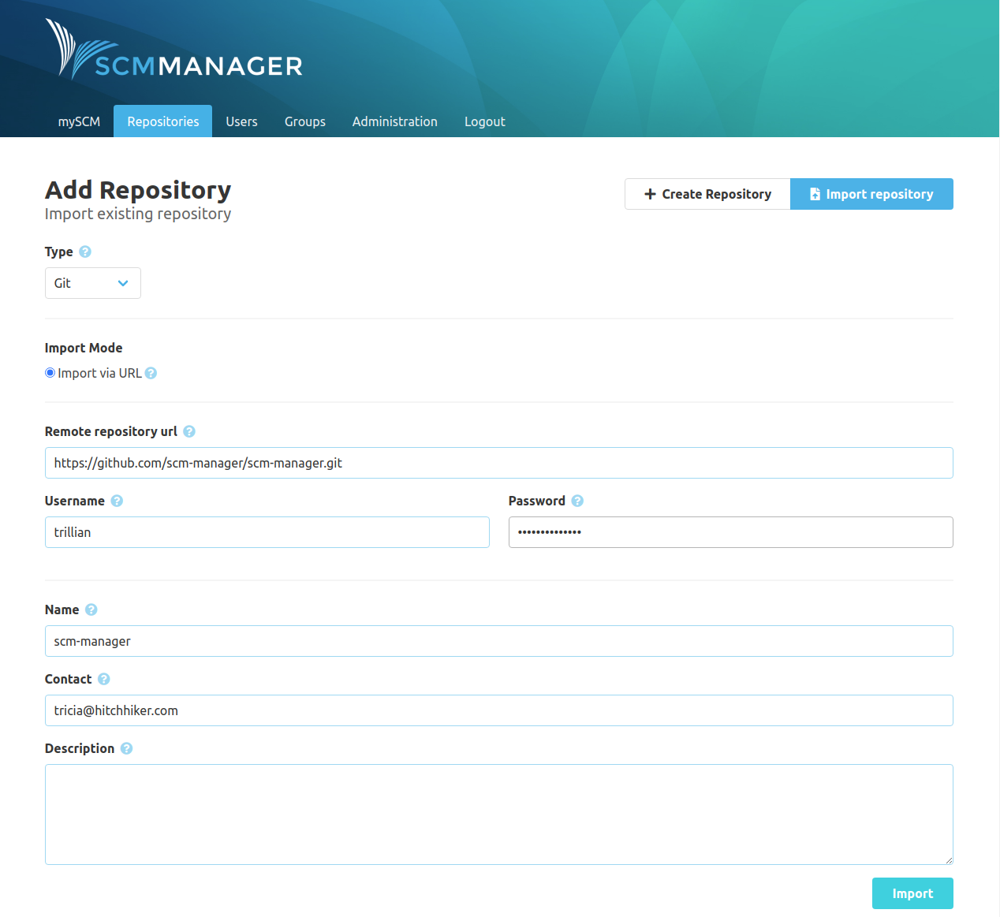
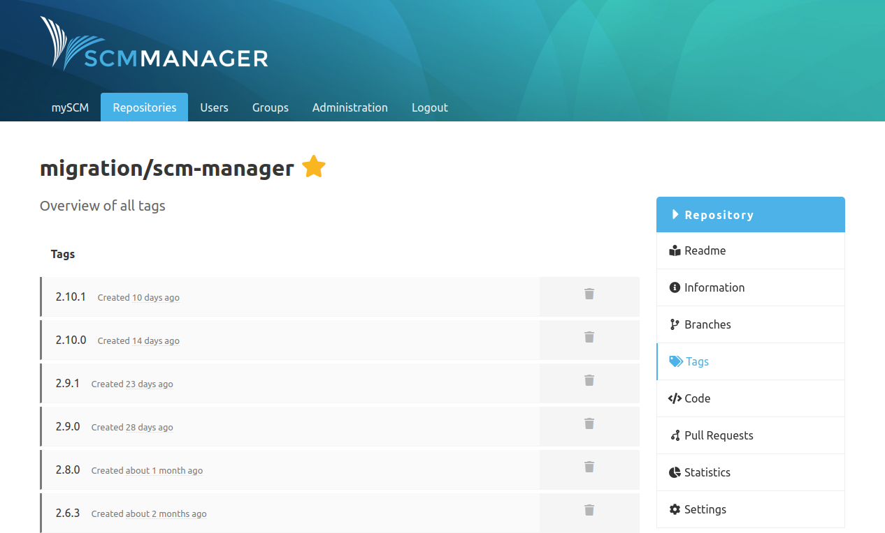
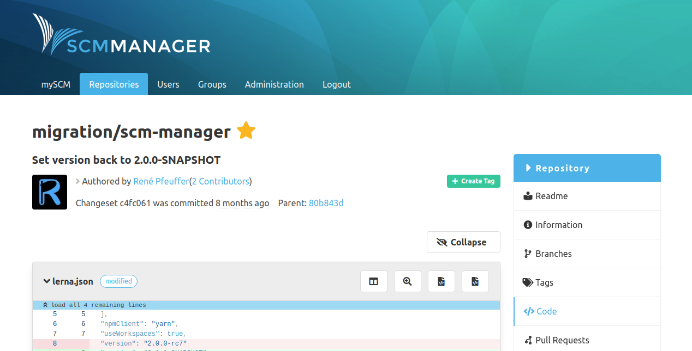
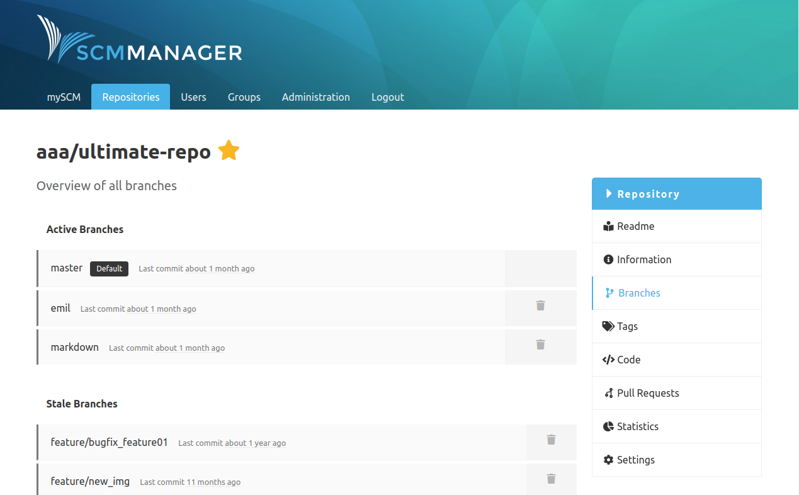

Dear SCM-Manager community,

today we released version 2.11.0 of SCM-Manager. Two big features are the import of git and mercurial repositories from URLs and
the creation and deletion of tags after our changes to the branch views in the last release. Talking of branches: These are now
separated into "active" and "stale" branches.

## Import Repositories

When you create new repositories you can now choose to import other repositories (for now git and mercurial). To do so, click
"Add Repository" and then select "Import repository" on the top right of the page. Here you can select the type (for now git or
mercurial) and then you can enter a repository URL (for example from GitHub). If this repository is not public, you can enter
username and password, too. Finally you just have to name the repository. If you installed the
[landingpage plugin](https://www.scm-manager.org/plugins/scm-landingpage-plugin) you will see the result in the "Latest activities",
with the [mail plugin](https://www.scm-manager.org/plugins/scm-mail-plugin) you will get a mail.

## Create and Delete Tags

Like for branches, you now can create and delete tags in SCM-Manager. To delete a tag, you can press the bin icon in the overview
or press "Delete tag" in the detail page for a tag. To create a new tag, you can use the little "Create Tag" button on the top
right of a changeset detail view.

## Active and Stale Branches

When you open the branches overview, you will notice that there are two tables: First there are the "Active Branches" below you
will find "Stale Branches". We deem branches as "stale", when the latest commit of this branch is 30 days behind the latest commit
of the default branch.

## Hook Simplification

Last but not least we changed the way mercurial hooks are processed in SCM-Manager. The new communication is way more simple and we removed a theoratical vulnerability on the way.

## Jenkins Plugin

Though this is no direct part of SCM-Manager, we want to point to our [Jenkins Plugin](https://plugins.jenkins.io/scm-manager/). Using
this you can create pipelines for single repositories and complete namespaces in Jenkins, trigger builds for branches, tags and pull requests
automatically and more.

Are you still missing an important feature? How can SCM-Manager help you to improve your work processes? We would love to hear you most needed features!

Have some questions or suggestions for SCM-Manager? Connect directly to the DEV-Team on [GitHub](https://github.com/scm-manager/scm-manager/) or [our Support channels](https://www.scm-manager.org/support/).
