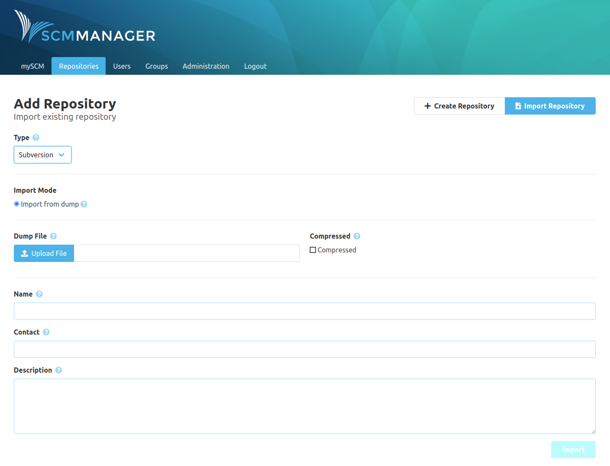
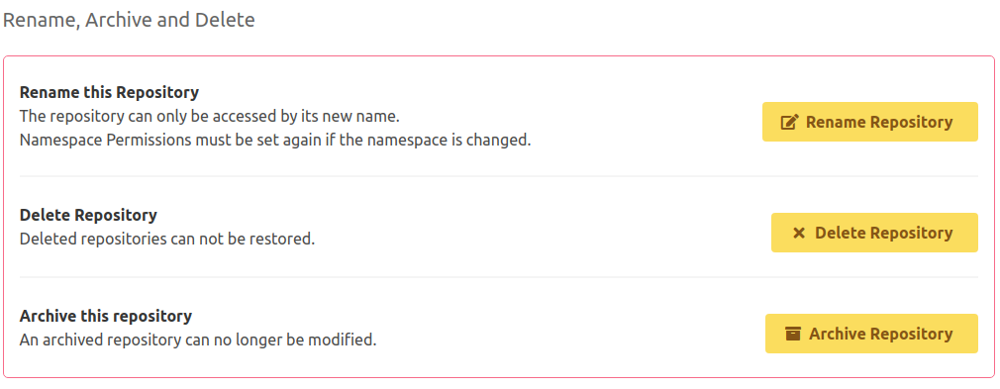

Dear SCM-Manager community,

two weeks have passed, and again we have another SCM-Manager release: 2.12.0. We have three gifts for you, and one for us:
Those of you using Mercurial can expect a much more simple setup, SVN users can now import SVN dumps, and all of you
together can use a feature known from 1.x again: the archived repository. And of course we fixed some bugs, for example
an error when you wanted to take a look at files with non-ascii characters in their names.

## Mercurial

Again and again people seeked help for not working Mercurial setups: Sometimes a path was wrong, sometimes the configured
python version mismatched the one used by Mercurial, and so on. This should belong to the past now. We managed to simplify
the somewhat complicated setup used to start Mercurial processes. You no longer need to specify a python binary, because
the communication layer between the SCM-Manager and the Mercurial process is now implemented as an extension. We would love
to get feedback for this one.

## Import of SVN dumps

With the last release we introduced the import of git and Mercurial repositories from other servers. Now we added the
possibility to import SVN dumps.

## Repository Archival

You may have known this feature from version 1.x, now it's available in 2.x again: You can mark repositories as "archived".
Such repositories cannot be modified any longer.

## Gradle

The gift we made for ourselfs is this: We start migrating our builds from Maven to [Gradle](https://gradle.org/). With the
increasing code size of SCM-Manager our builds took more and more time, slowing down our development speed. In a first step
we created the [Gradle SMP Plugin](https://github.com/scm-manager/gradle-smp-plugin) to build our plugins with. We will
now collect practical experience with this, but the first look is promising.

Are you still missing an important feature? How can SCM-Manager help you to improve your work processes? We would love to hear you most needed features!

Have some questions or suggestions for SCM-Manager? Connect directly to the DEV-Team on [GitHub](https://github.com/scm-manager/scm-manager/) or [our Support channels](https://www.scm-manager.org/support/).
