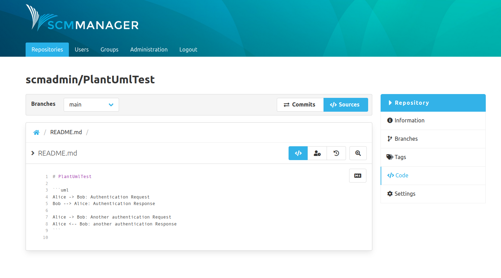
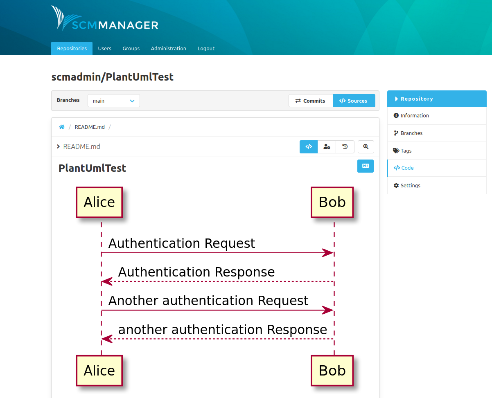

Dear SCM-Manager community,

it has been some time since we have released the last version of the SCM-Manager at the end of last year.
This was over four weeks ago. Rest assured we were not in hibernation but used the time to tackle some larger features
which we now proudly present to you.

## Extended Export & Import

We built upon the rudimentary export functionality we implemented for subversion in the last release.
Now it is possible to export repositories of any type, subversion, git and mercurial.
Optionally you can export the repository compressed and/or with additional metadata.
Please be aware that the export with metadata is still experimental and should not yet be used for backups.

An exported repository archive contains additional repository-specific data.
Through the metadata-import this data can be imported.

## PlantUML Plugin

We created a new plugin which extends our markdown renderer by allowing you
to write PlantUML codeblocks that will be automatically rendered in the markdown view.

This is very useful for visual documentation of processes and interactions.

## Permalinks

It is now possible to create a permalink to the active path in the source code view, may it be file or directory, by
clicking the button on the left-hand side of the breadcrumbs navigation. The created link will be automatically copied
to your clipboard. For all your sharing needs!

## Gradle

The transition to Gradle as our primary internal build tool has taken quite some time.
It is a major improvement but there is still some way to go.
Some of the benefits include much better performance of our build pipeline and
increased usability for our development team.
Any plugins which are still written for Maven can be migrated towards Gradle with our [dedicated tool](https://github.com/scm-manager/smp-maven-to-gradle).

## Closing Words

Are you still missing an important feature? How can SCM-Manager help you to improve your work processes? We would love to hear you most needed features!

Have some questions or suggestions for SCM-Manager? Connect directly to the DEV-Team on [GitHub](https://github.com/scm-manager/scm-manager/) or [our Support channels](https://www.scm-manager.org/support/).
