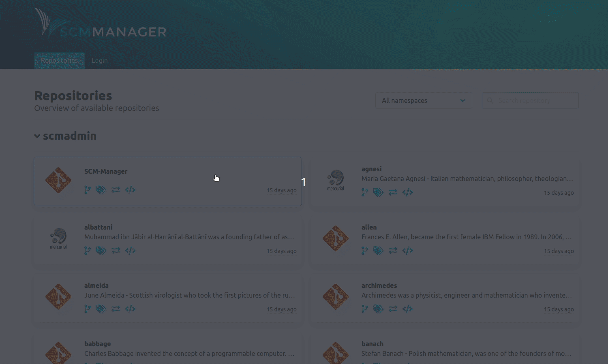

Dear SCM-Manager community,

A month has passed, and we have been very busy implementing new features for you.
We have focused on two larger areas during this time period to get the biggest improvements for everyone using
the SCM-Manager on a daily basis.

## Wrapping up Export & Import

We first started the import topic mid December and with this release finished the whole thing.
It has been an enormous amount of work for a rich feature-set. We are proud of the results and 
would love you to give it a try.

## Frontend Performance

We have had a lot of feedback both internally and from the community about the user interface
feeling sluggish. We listened carefully and used the opportunity to remove tremendous amounts of bad legacy code
while rewriting other parts to be more readable. The biggest benefit to the users, of course is the
introduction of the stale-while-revalidate pattern to our whole frontend application. While not always being literally faster,
the perceived performance, and the performance when switching back-and-forth between pages has improved drastically.
We now display cached data for every screen and re-fetch up-to-date data in the background.
Users will not notice this but instead the whole interface will feel quicker and more responsive.

For further information please have a look at the [official react-query documentation](https://react-query.tanstack.com/).

## Closing Words

Are you still missing an important feature? How can SCM-Manager help you to improve your work processes? We would love to hear you most needed features!

Have some questions or suggestions for SCM-Manager? Connect directly to the DEV-Team on [GitHub](https://github.com/scm-manager/scm-manager/) or [our Support channels](https://www.scm-manager.org/support/).
