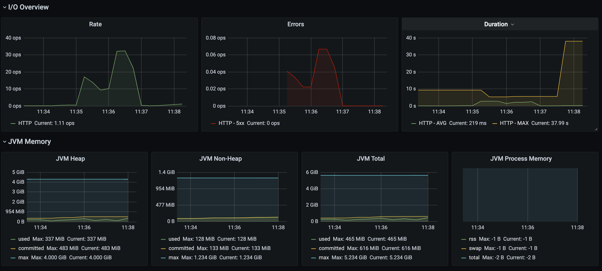
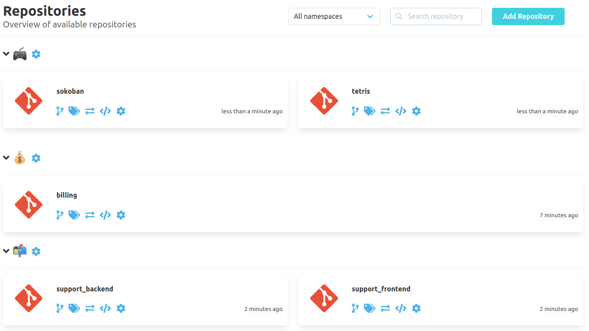

Hey SCM-Manager community,

We have made some radical changes in the last releases, and sometimes this breaks
things. So we have not come around of fixing some more or less minor bugs the last
weeks. But of course we also have new nice features for you: To reveal internals, we
have added lots of metrics for you to explore, and for all users with non-ascii
languages and all friends of emoticons we have relaxed the rules for namespaces,
groups and usernames: You can now use nearly all Characters coming to your mind.

Checkout the newest release to find about everything that changed.

## More Metrics

To make it short: You can now get metrics for

- http requests,
- authentication,
- executor service,
- caches,
- work directories, and
- events (there are lots of them)

Feel free to tell us, if you miss something.

## UTF-8

It all began with a request, whether it would be possible to use Cyrillic letters for
group names. What we ended up with is the support of UTF-8 in groups, usernames and namespaces.
No idea how to call your namespaces? Now you can do this (but use it with care):

## Closing Words

Are you still missing an important feature? How can SCM-Manager help you to improve your work processes? We would love to hear you most needed features!

Have some questions or suggestions for SCM-Manager? Connect directly to the DEV-Team on [GitHub](https://github.com/scm-manager/scm-manager/) or [our Support channels](https://www.scm-manager.org/support/).
