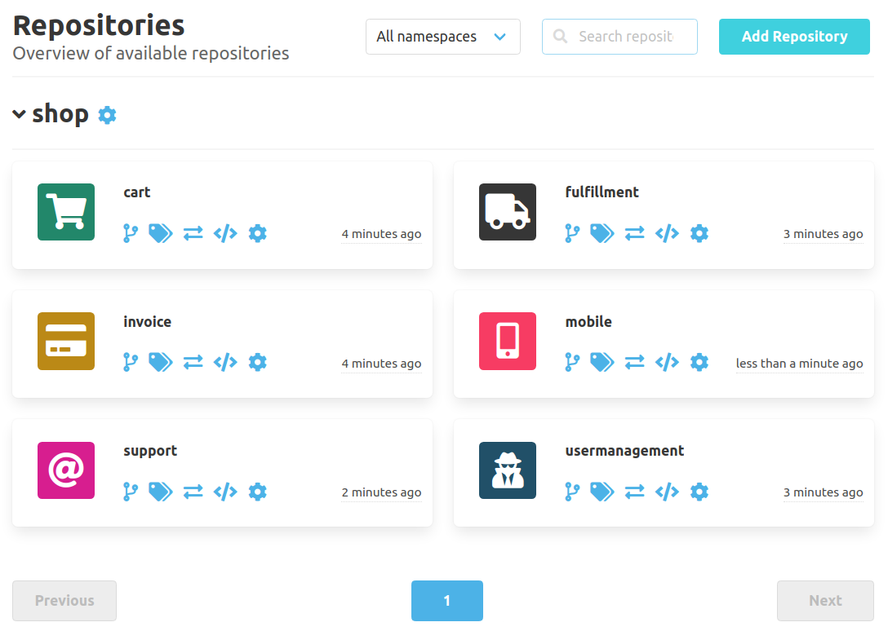
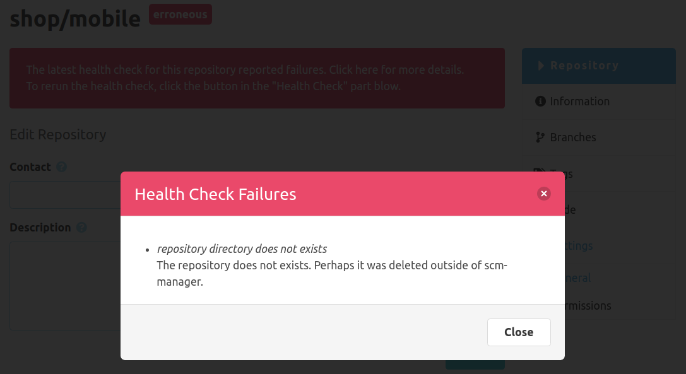

Hey SCM-Manager community,

A new release is ready, bringing avatars for repositories, health checks, and
some more fixes, especially in plugins.

## Repository Avatars

Ever got lost in an SCM-Manager with lots of repositories? Then it's time to allow
your imagination run free: With the new
[avatar plugin](https://www.scm-manager.org/plugins/scm-repository-avatar-plugin/)
you can set avatars for each repository. Either use the default avatar build from
the first letters of the namespace and name, choose from a collection of different
icons, or import your own image (jpeg, png, gif or svg, even animated).

## Health Checks

No matter how hard you try, your infrastructure may break in one place or another.
From version 1.x you may remember the health checks. Those are back now. At startup,
SCM-Manager checks some basic stuff like the existence of directories, so that
you will get quick feedback for example when your mounted drive is missing. These
checks can be triggered from the settings dialog whenever you have a the feeling
something may be wrong. These manual checks may also run some more in-depth checks,
depending on the type of the repository.

## Fixes

Since the introduction of react-query in release 2.15.0, some plugins had the issue
of involuntary reloads on focus changes. These should be fixed, now (for example
for the [OpenAPI plugin](https://www.scm-manager.org/plugins/scm-openapi-plugin/)
or the [script plugin](https://www.scm-manager.org/plugins/scm-script-plugin/)).

Another more tempting change regarding markdown views leeds to better and more secure
sanitization of markdown content by including [rehype](https://github.com/rehypejs/rehype).

## Closing Words

Are you still missing an important feature? How can SCM-Manager help you to improve your work processes? We would love to hear you most needed features!

Have some questions or suggestions for SCM-Manager? Connect directly to the DEV-Team on [GitHub](https://github.com/scm-manager/scm-manager/) or [our Support channels](https://www.scm-manager.org/support/).
