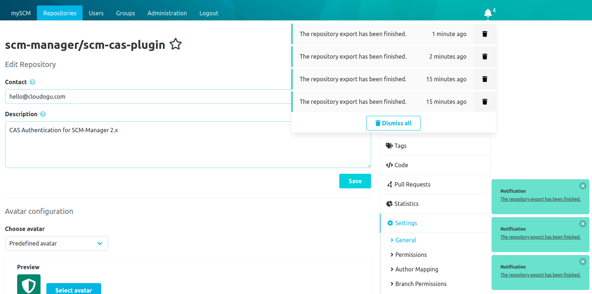
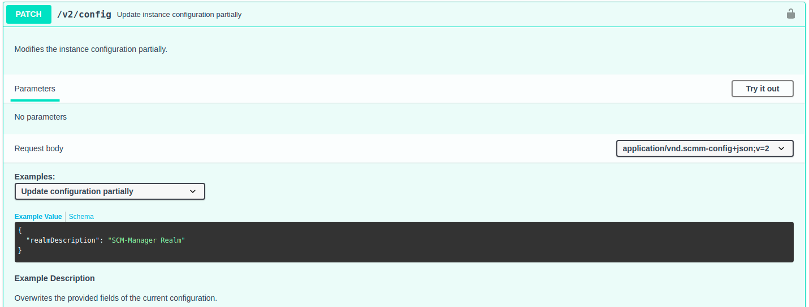

Hey SCM-Manager community,

in the newest release we mostly fixed bugs and improved our own development cycles. 
Nonetheless, we have two new features we wanted to point out to you.

## Global Notifications

When developing features in the past, we have come across the need for a global notification system.
This can be especially useful when a user triggers an asynchronous, time-consuming process and navigates to another page, such as repository export.
In short, we added a global notification system consisting of toast messages and a notification feed.

## PATCH endpoints

SCM Manager 2 can be controlled to a large extent via the REST API. 
A gap in our REST API were PATCH endpoints, which allow to update data partially. 
This is especially useful for configurations when only a few fields need to be changed. 
We addressed this issue and created a PATCH endpoint for the global SCM Manager configuration as a first step.

## Closing Words

Are you still missing an important feature? How can SCM-Manager help you to improve your work processes? We would love to hear you most needed features!

Have some questions or suggestions for SCM-Manager? Connect directly to the DEV-Team on [GitHub](https://github.com/scm-manager/scm-manager/) or [our Support channels](https://www.scm-manager.org/support/).
