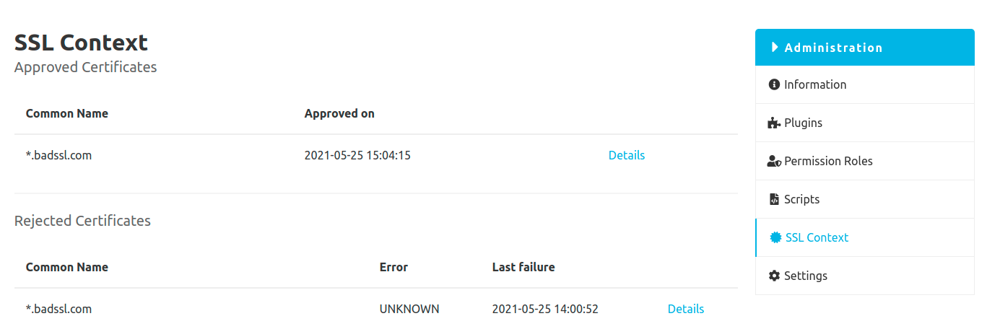
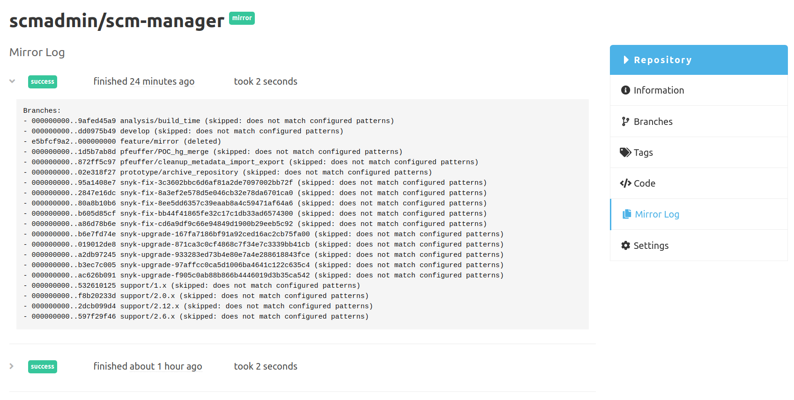

Hey SCM-Manager community,

with release 2.19.0 we have prepared SCM-Manager for two new plugins we hope you will find useful:
The SSL context plugin and the repository mirror plugin.

## SSL Context Plugin

For a long time SCM-Manager offers lots of plugins providing connections to other services such as Jenkins, Jira, Mail,
and so on. Of course these connections should be secure, hence use TLS encrypted connections. In some environments,
it still can be a challenge to create or get valid certificates accepted by a default Java installation.

With the new [SSL contex plugin](https://www.scm-manager.org/plugins/scm-ssl-context-plugin/) you can now inspect and (if they
look legit to you) approve certificates that have been rejected by SCM-Manager.

## Mirror Repositories

Some releases ago we introduced the import of repositories. Now we've taken the next step: You can now create so-called
mirror repositories with the [SCM repository mirror plugin](https://www.scm-manager.org/plugins/scm-repository-mirror-plugin/)
(for Git and SVN).
Such a mirror cannot be modified. Instead, it will create a clone of another repository and fetch changes in
configurable intervals. In contrast to for example `git clone --mirror`, you can specify which branches and tags to
mirror and set other preconditions.

## Closing Words

Are you still missing an important feature? How can SCM-Manager help you to improve your work processes? We would love to hear you most needed features!

Have some questions or suggestions for SCM-Manager? Connect directly to the DEV-Team on [GitHub](https://github.com/scm-manager/scm-manager/) or [our Support channels](https://www.scm-manager.org/support/).
