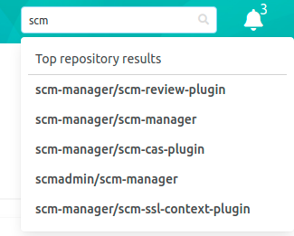
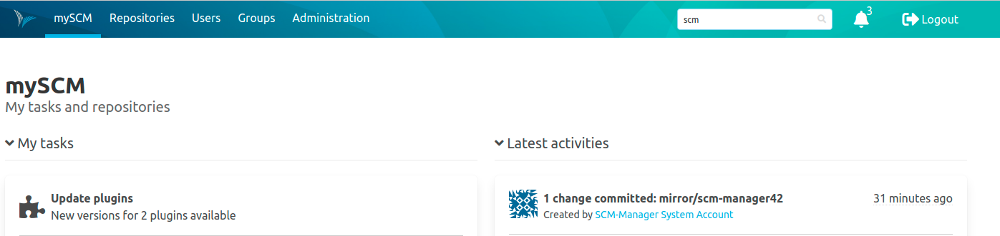
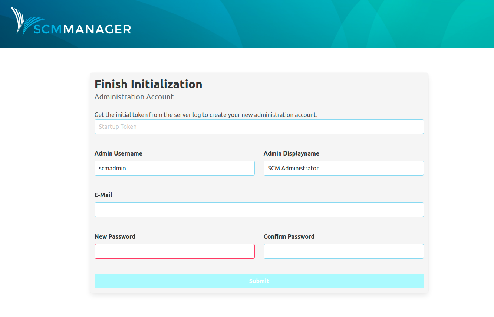

Hey SCM-Manager community,

we took another big steps in the SCM-Manager development. We are really excited to tell you about the newest changes.

## Omni search

One huge feature that we missed so far in SCM-Manager is the **omni search**. 
As the first implementation we added a quick search to the header which you can use to search for your repositories. 
We are already working on the advanced searches, so you will be able to also search for users, groups, inside your code, ...

Hint: We implemented the search with [Lucene](https://lucene.apache.org/), so can already use the default lucene search syntax on your advanced queries.

## UI Redesign - Header

We started to redesign the SCM-Manager UI. This time we changed the header which is now smaller and way more responsive than before.

## Initial admin user

For security reasons we no longer provide the default admin user for your SCM-Manager instance. 
Now you have to create your admin on your first access to SCM-Manager via the UI. 
To create the administrator you need an initialization token which you can find inside your server log.

Hint: For automatic deployments you can create the administrator user automatically by setting the username and password with system properties. Check out the [initialization documentation](https://scm-manager.org/docs/2.21.x/en/first-startup/).

## Other changes
- The date on the repository overview is now the last modified date of the repository.
- With the newest version of the [editor plugin](https://scm-manager.org/plugins/scm-editor-plugin/) you can create files in empty repositories.
- Improved cache invalidation when creating/deleting gpg keys.
- Cloudogu plugins are now included in the SCM-Manager plugin center.

## Closing Words

Are you still missing an important feature? How can SCM-Manager help you to improve your work processes? We would love to hear you most needed features!

Have some questions or suggestions for SCM-Manager? Connect directly to the DEV-Team on [GitHub](https://github.com/scm-manager/scm-manager/) or [our Support channels](https://www.scm-manager.org/support/).
