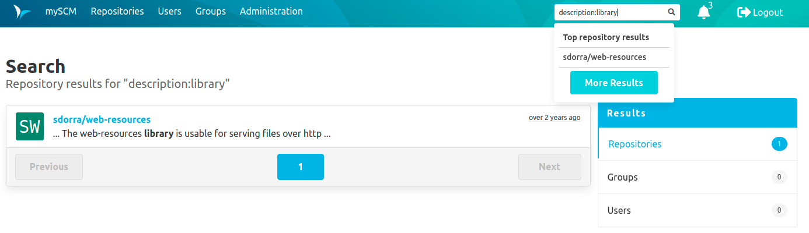
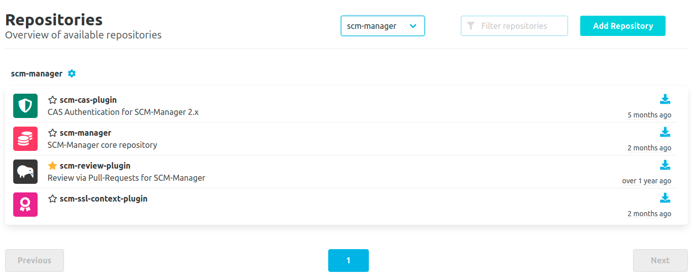

Hey SCM-Manager community,

today we present you the next iteration of the new omni search and also the new design of the repository overview.
We also added powerful caching for internal working copies and fixed some bugs you reported.

## Omni Search - Details Page
With the last release, we added the search for repositories using the omni search in the header. Now, with the new release, we've added a button to show **More Results** additionally to the repositories shown as quick results. 
This leads to the new search details page which shows all search results categorized by the result type. If you search for repository descriptions, we also added highlighting inside the matching text fragments.

Tell us what you think about the new features and also stay excited since we've just started to implement the code search, so you can search inside your repository files, soon.

## UI Redesign - Repository Overview

After the header, we have now redesigned the repository overview. We hope it is now clearer and easier to use.
We really need your opinion on this, so please give us feedback on how you like our changes.

## Caching for Working Directories

This feature is still experimental and a little hidden. Now you can activate caching for the internal working copies. 
This is especially helpful if you work a lot with the [editor plugin](https://scm-manager.org/plugins/scm-editor-plugin/) or the [review plugin](https://scm-manager.org/plugins/scm-review-plugin/), since it boosts the performance dramatically.

Try it out following our [documentation](https://scm-manager.org/docs/latest/en/administration/workdir_caching/).

## Other changes
- We fixed the file detection for hg repositories if directory and files were named the same
- We decreased the log level of `DefaultAdministrationContext` from info to debug
- We designed a new logo for the small header
- We removed the repository short links on the overview since they were not used at all.

## Closing Words

Are you still missing an important feature? How can SCM-Manager help you to improve your work processes? We would love to hear you most needed features!

Have some questions or suggestions for SCM-Manager? Connect directly to the DEV-Team on [GitHub](https://github.com/scm-manager/scm-manager/) or [our Support channels](https://www.scm-manager.org/support/).
