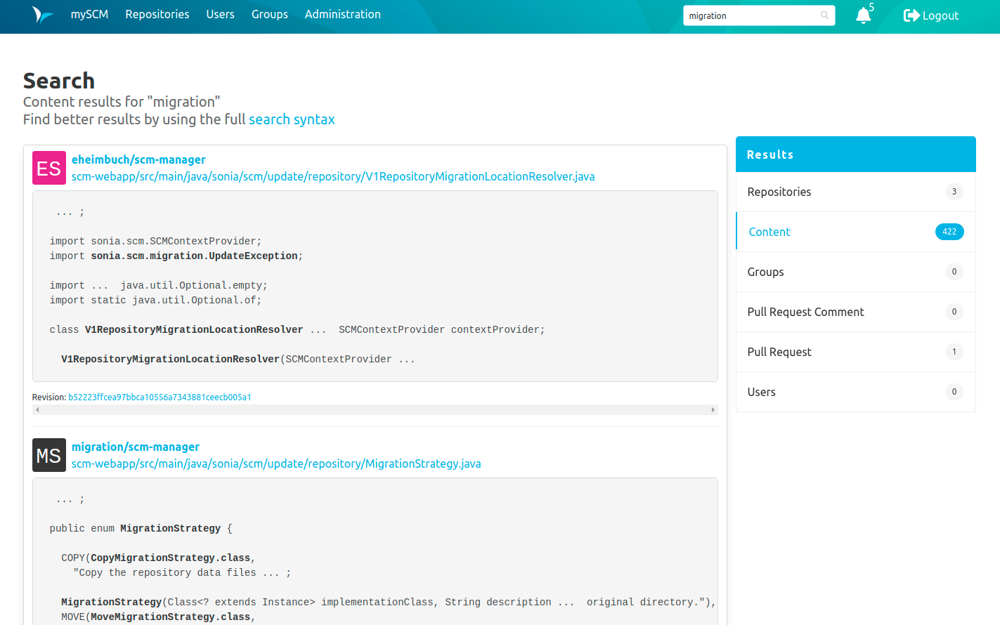
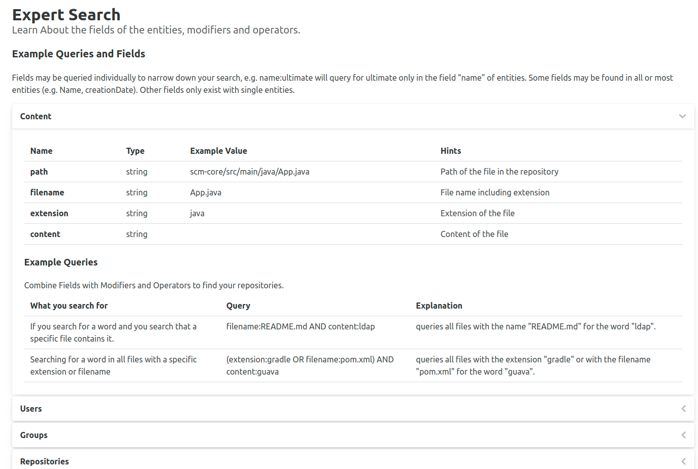

Hello Community,

today we released SCM Manager 2.23.0 which brings global search to a whole new level.

## Search
Search was introduced with the quick repository search bar in version 2.21.0. Version 2.22.0 comes with a details page and allows searching by users and groups.
Since version 2.21.0, we have learned a lot. We've learned what we want to search for and how we want to search.
These learnings have led to a complete redesign of the search API and index.

Prior to version 2.23.0, all searchable items were included in the same index and separated by a type field.
However, this caused problems during analysis, especially for fields that have the same name but are of different types and should be analyzed differently.
With version 2.23.0, we create a separate index for each type. We have developed an API that makes it easier to handle multiple indexes.

The new version prepares the search and its APIs for new types of plugins:

- Pull Requests ([Review Plugin](https://scm-manager.org/plugins/scm-review-plugin/))
- Comments ([Review Plugin](https://scm-manager.org/plugins/scm-review-plugin/))
- File Contents ([Content Search Plugin](https://scm-manager.org/plugins/scm-content-search-plugin/))

File content search will get its own blog post soon.

Since the first version of the search it was possible to search in simple or expert mode.

### Simple mode
Simple mode is the default setting and means that you enter the word you are searching for and that's it.
The search looks for the entered value in a set of standard fields for each searchable type, e.g:
Simple search looks in the namespace, name and description fields for the repository type.

If you want to make your search more specific, you should take a look at the expert mode.

### Expert mode
Expert mode is automatically used when you enter a `:` in your query, since the `:` is the separator between the field and the value.
With the expert mode it is possible to search explicitly in certain fields, for example:

`type:git`

returns any repository of type git.

It is also possible to use operators to create more complex queries, such as:

`type:svn AND creationDate:[1577833200000 TO 1609369200000]`

The above query will return all svn repositories created in 2020.

You may wonder how to remember the syntax and how to know these fields.
For this reason we have created a special syntax help page.

### Syntax page
The syntax page explains how to use the SCM Manager expert search.
It lists operators, modifiers, wildcards, groupings, etc.
It also shows the types that are searchable in your SCM Manager instance (types depend on permissions and installed plugins).
Each type is listed with its fields, descriptions and some examples.

### Central work queue
During the development of the [Content search plugin](https://scm-manager.org/plugins/scm-content-search-plugin/),
we encountered several problems with the old indexing API.
The main problems were too much memory consumption and the order of indexing tasks.
This problem has led to another new API, the central work queue.
This new API should handle most asynchronous, long-running tasks in the future.
In the first version, it is only responsible for the various indexing tasks.

### What else?
There were a lot of minor user interface changes around quick search and detailed search.
We have also improved how things are indexed, for example before 2.23.0 it was not possible to search for values with a hyphen.

### Besides the search
There were a few bugs you reported that we were able to fix with this version, e.g:
- The request method was lost on the Force Base Url Redirect 
- The login page was broken when the login info response could not be parsed.

## Final words
Are you still missing an important feature? How can SCM Manager help you improve your work processes? We would love to hear from you about what you need most!

Do you have any questions or suggestions about the SCM Manager? 
Contact the DEV team directly on [GitHub] (https://github.com/scm-manager/scm-manager/) and make sure to check out our new [community platform] (https://community.cloudogu.com/c/scm-manager/).
