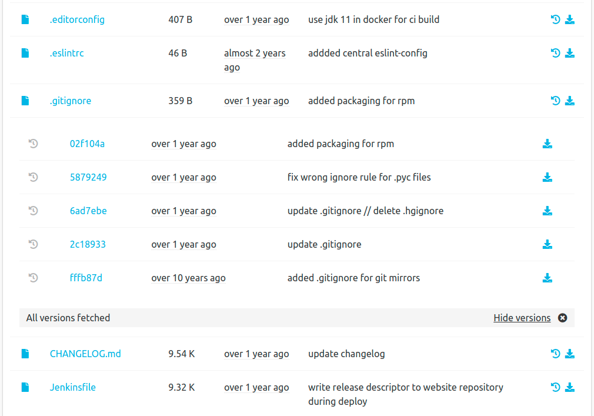
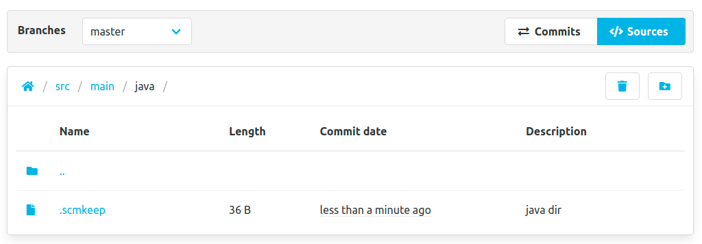
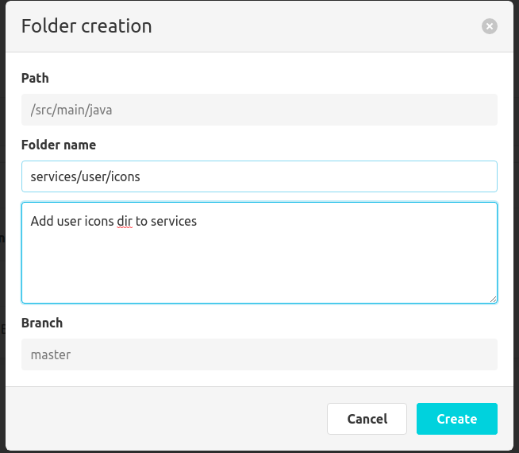

Hello SCM-Manager Community,

Since SCM-Manager is mainly concerned with repository management, our target audience is mostly from the IT field.
However, during the development of SCM-Manager we found that other fields like engineers, craftsmen, scientists and office workers also want to use this tool for their purposes and workflows.
SCM-Manager is a repository-focused tool, and we have no plans to change that.
Nonetheless, since it is already possible to write plugins for almost anything without bloating the core of SCM-Manager,
we would like to support other users besides developers and administrators.
That's why we developed two new plugins that will make it easier for non-IT people to work with the SCM-Manager.

## History Download Plugin
The [History Download Plugin](/plugins/scm-landingpage-plugin/) is more like a shortcut for a feature which was already technically possible. 
On the sources view you can see the files inside a repository. 
Click on the new icon to expand history view with all versions of this file and the direct download links.
You see the 10 latest changes but can fetch more results as you click on the bar below.

This feature was requested by SCM-Manager users who wanted to access their binary files directly from the sources view.

## Manage Folder Plugin
The [Manage Folder Plugin](/plugins/scm-manage-folder-plugin) is perfect for people who are used to working with directories.
By default, Git and Mercurial don't know directories at all, only files and paths.
We wanted to make creating new directories and deleting entire directories more intuitive for office workers (similar to the Windows Explorer).
To realize this feature with the different clients Git, HG and SVN, we introduced an `.scmkeep` file that holds your directory structures.

By clicking on the create button a folder creation modal shows up. You can create sub-directories on one or more nested levels. 
Since these are repositories, each change has to be a commit/changeset. If you delete directories, all included files and sub-directories also get deleted.

Recommendation: This plugin is a great addition if you already work with the [Editor Plugin](/plugins/scm-editor-plugin/).

### Minor changes
- We fixed some minor bugs in the global search.
- We cleaned up our own frontend code and prepared for upcoming accessibility improvements.
- We fixed a bug regarding incorrect encoding for SVN directories with whitespaces.

## Final words
Are you still missing an important feature? How can SCM Manager help you improve your work processes? We would love to hear from you about what you need most!

Do you have any questions or suggestions about the SCM Manager?
Contact the DEV team directly on [GitHub] (https://github.com/scm-manager/scm-manager/) and make sure to check out our new [community platform] (https://community.cloudogu.com/c/scm-manager/).
