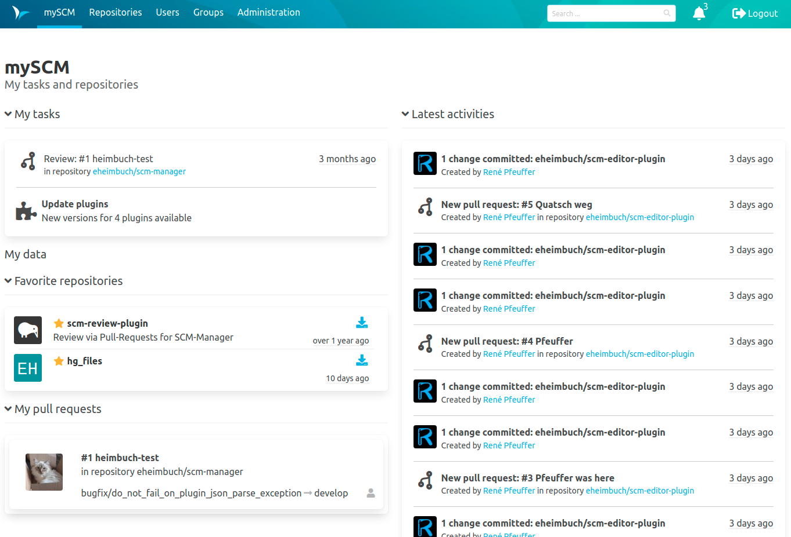
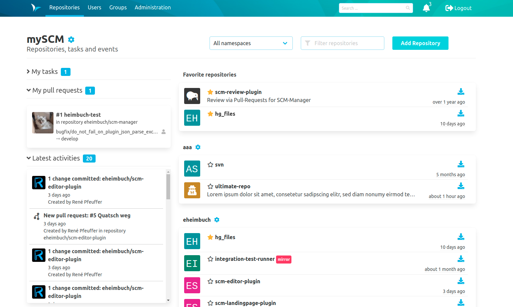
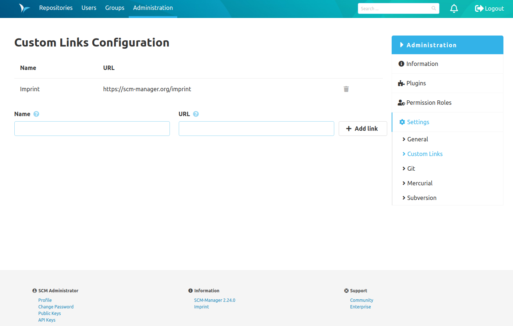

Hey SCM-Manager Community,

With the new version 2.25.0 we have completely redesigned the landing page.
We also fixed some minor bugs and added some minor features to various plugins.
Our next big topic will be **accessibility aka a11y**.
Here we will improve keyboard navigation and screen reader support, and we have already started to create our new theme `High Contrast Mode` which is actually dark but not the `Dark Mode`.
But let's talk about what the current version includes.

## Landing Page Plugin
SCM-Manager already provided a [Landing Page Plugin](https://scm-manager.org/plugins/scm-landingpage-plugin/) which adds a new start page before the repository overview. 
This page showed all user related information like favorite repositories, open tasks and recent events in SCM-Manager.

**OLD LANDINGPAGE**

We improved this landing page by merging it into the repository overview. 
We transferred the additional widgets like favorite repositories and also make it customizable by each user which widgets should be shown on your repository overview.

**NEW LANDINGPAGE**

Tell us how you feel about these changes and what else we could do to improve your efficiency working with SCM-Manager.

## Custom Links Plugin
We created a new plugin which allows you to add custom links to your SCM-Manager footer. 
You can add your imprint, legal pages or some instance related links, so every user can reach them.

This plugin is currently not available from the official SCM-Manager plugin center. You have to install it manually from the [Community Forum](https://community.cloudogu.com/t/instructions-custom-links-plugin-for-scm-manager/289).

### Minor changes / bug fixes
- We added a conflict check for the [Editor Plugin](https://scm-manager.org/plugins/scm-editor-plugin/) to prevent overwriting files if someone else has already changed them.
- We added another specific permission with write access for the [SSL Context Plugin](https://scm-manager.org/plugins/scm-ssl-context-plugin).
- The footer is now also displayed on the login page.
- The [Repository Template Plugin](https://scm-manager.org/plugins/scm-repository-template-plugin) can now automatically mark repositories as templates by using the corresponding action in the repository settings.
- It is no longer possible to delete the default branch of a repository as this causes several problems in the SCM-Manager.

## Final words
Are you still missing an important feature? How can SCM Manager help you improve your work processes? We would love to hear from you about what you need most!

Do you have any questions or suggestions about the SCM Manager?
Contact the DEV team directly on [GitHub](https://github.com/scm-manager/scm-manager/) and make sure to check out our new [community platform](https://community.cloudogu.com/c/scm-manager/).
