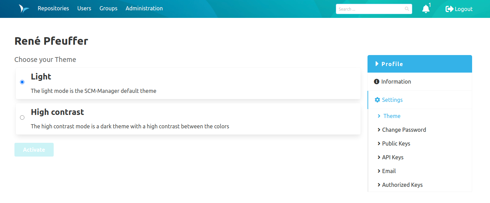
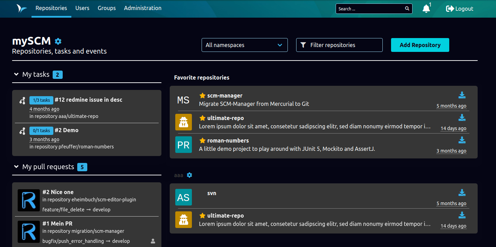
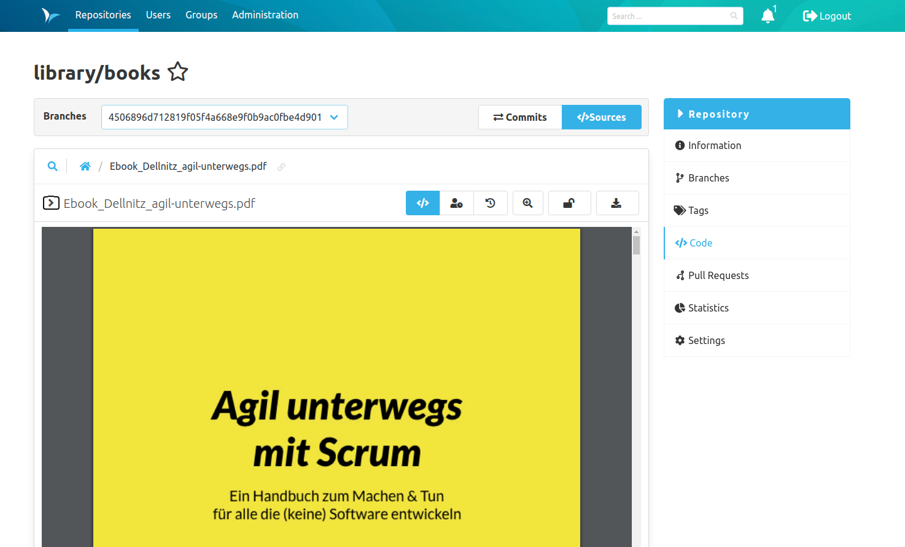

Hey SCM-Manager Community,

we would like SCM-Manager to be accessible for as many users as possible. We aren't there, yet,
but we have taken some major steps. Maybe the most obvious one: You can change your theme.

## Accessibility

As well as it might seem so, our first goal was not to create a dark mode, but a theme with high
contrast. You can change your preferences on your profile page. Turning colors inside out is no
easy task (aside from the technical requirements). But you have to start somewhere, so we present
this new design knowing, that we still have some flaws like the header in the source view. We will
tackle these in the next releases, so please stay patient.

The high contrast mode now looks something like this:

And for those who depend on screen readers, we have some advancements, too: We have added lots of
`alt` tags and made errors accessible.

We would love to get feedback from you!

## PDF Preview

From this release on, we will show PDF files in the file view, just like images.

## LFS Lock Protocol

For fans of [Git LFS](https://git-lfs.github.com/), we have implemented the
[file lock protocol](https://github.com/git-lfs/git-lfs/wiki/File-Locking). Mind that you will
not see those locks in the frontend, but we are working on this right now.

## Final words
Are you still missing an important feature? How can SCM Manager help you improve your work processes? We would love to hear from you about what you need most!

Do you have any questions or suggestions about the SCM Manager?
Contact the DEV team directly on [GitHub](https://github.com/scm-manager/scm-manager/) and make sure to check out our new [community platform](https://community.cloudogu.com/c/scm-manager/).
