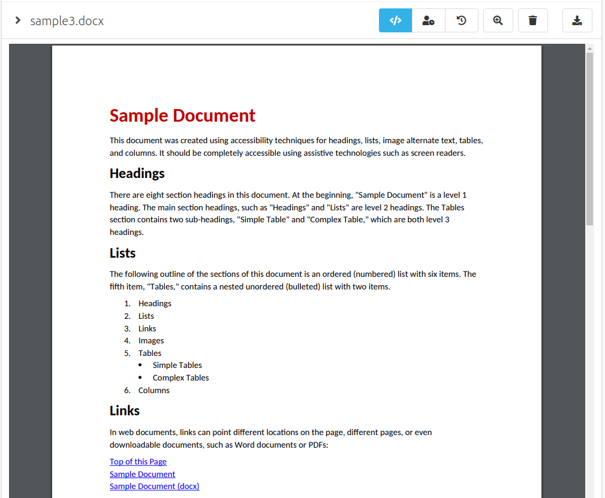
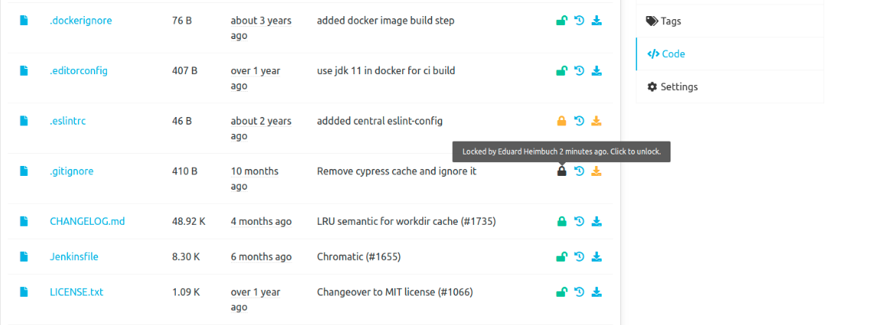

Hey SCM-Manager Community,

once again we improved the accessibility by cleaning up our html structure and improve the screen reader support. 
Besides, we also created two new plugins which may be useful for your workflows with SCM-Manager.

## Gotenberg Plugin

Some weeks ago we learned about [Gotenberg](https://gotenberg.dev/) as an easy-setup, powerful server to convert office binary files like `docx`, `xlsx` and `pptx` to pdf. 
We created the [Gotenberg Plugin](/plugins/scm-gotenberg-plugin) to integrate this mechanism into SCM-Manager. Now all binary files which can be processed by Gotenberg are directly show as pdf inside your SCM-Manager.

### Word Document

### Excel Sheet

### PowerPoint Presentation

### Configuration
For this to work you have to start a Gotenberg server and configure it in SCM-Manager. Example [docker-compose](https://github.com/scm-manager/scm-gotenberg-plugin/blob/develop/docker-compose.yml).

If your SCM-Manager is running inside the [Cloudogu Ecosystem](https://cloudogu.com/en/ecosystem/), you can install the Gotenberg Dogu for free and restart SCM-Manager. 
The plugin will be automatically installed and configured for you.

## File Lock Plugin

The second new plugin we want to introduce is the [File Lock Plugin](/plugins/scm-file-lock-plugin). 
This plugin enables frontend support for the file locks we introduced in version 2.26.0.
It can be helpful to lock files, especially binary files, if you are editing them. 
This way other users will know the file is currently locked by you and can not be edited without unlocking it before.

If someone tries to overwrite your locked file by uploading a newer version, a warning will appear.
Locked files can be unlocked by every user with write permission to the repository to prevent locking files longer than needed.

## Other changes
- Upgrades to Webpack 5 and Node 16
- Improved screen reader support
- Show Repository Contact on overview
- Fix minor ui glitches after introducing the high contrast mode

## Final words
Are you still missing an important feature? How can SCM-Manager help you improve your work processes? We would love to hear from you about what you need most!

Do you have any questions or suggestions about the SCM-Manager?
Contact the DEV team directly on [GitHub](https://github.com/scm-manager/scm-manager/) and make sure to check out our new [community platform](https://community.cloudogu.com/c/scm-manager/).
