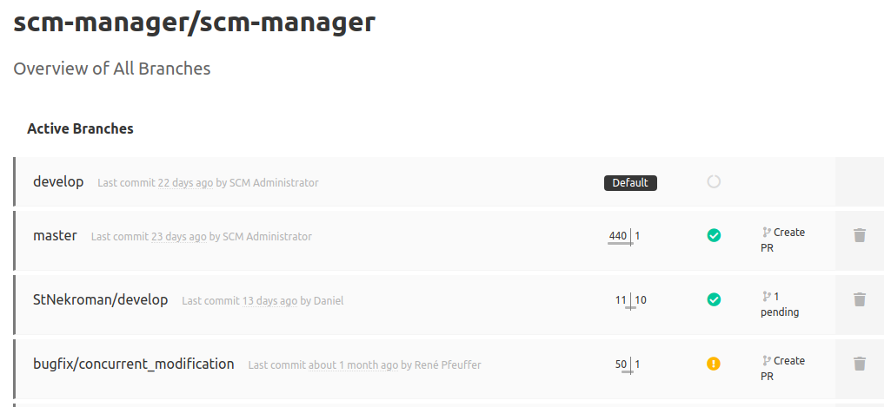
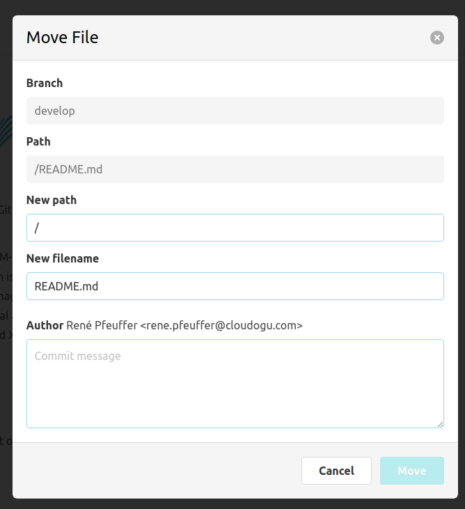
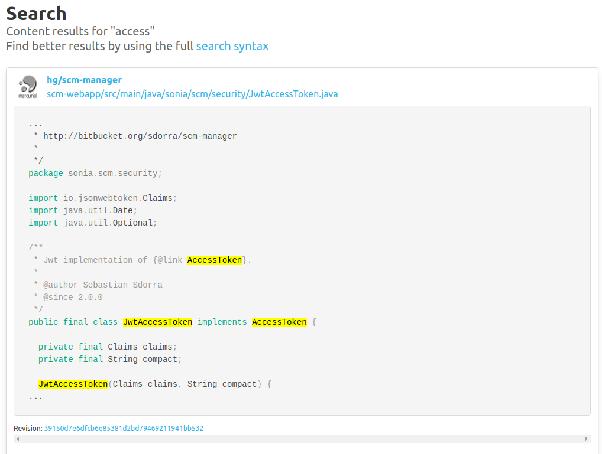

Hey SCM-Manager Community,

some time has passed sind 2.27.0, and the hassle around log4shell brought us some bugfix releases (because we
use logback and not log4j, we had some less severe issues in SCM-Manager).
But now it is time for a new feature release 2.28.0.

## Branch Details

If you take a look at the branches for a repository, you will find small graphs to tell you, how many commits
a branch is ahead and/or behind in regard to the default branch. And if you use the
[review plugin](https://scm-manager.org/plugins/scm-review-plugin/) or the
[ci plugin](https://scm-manager.org/plugins/scm-ci-plugin/), you will also find information about
pull requests and the current build status of the branch.

## Move/Rename

Don't want to clone a repository just to rename a file or directory? Now you can do this with the
[editor plugin](https://scm-manager.org/plugins/scm-editor-plugin/). We hope you will find this useful.

## Fixes

The high contrast mode had some issues like unreadable colors in the user/group select component for example.
We fixed the flaws in the core (and we promise to fix the remaining bugs in some plugins soon).

And the next time you use the search functionality, you may notice some changes, too, like code highlight if you
have installed the [content search plugin](https://scm-manager.org/plugins/scm-content-search-plugin).

## Final words
Are you still missing an important feature? How can SCM-Manager help you improve your work processes?
We would love to hear from you about what you need most!

Do you have any questions or suggestions about the SCM-Manager?
Contact the DEV team directly on [GitHub](https://github.com/scm-manager/scm-manager/) and make sure
to check out our new [community platform](https://community.cloudogu.com/c/scm-manager/).
