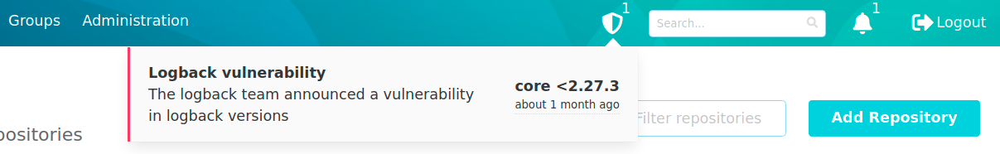
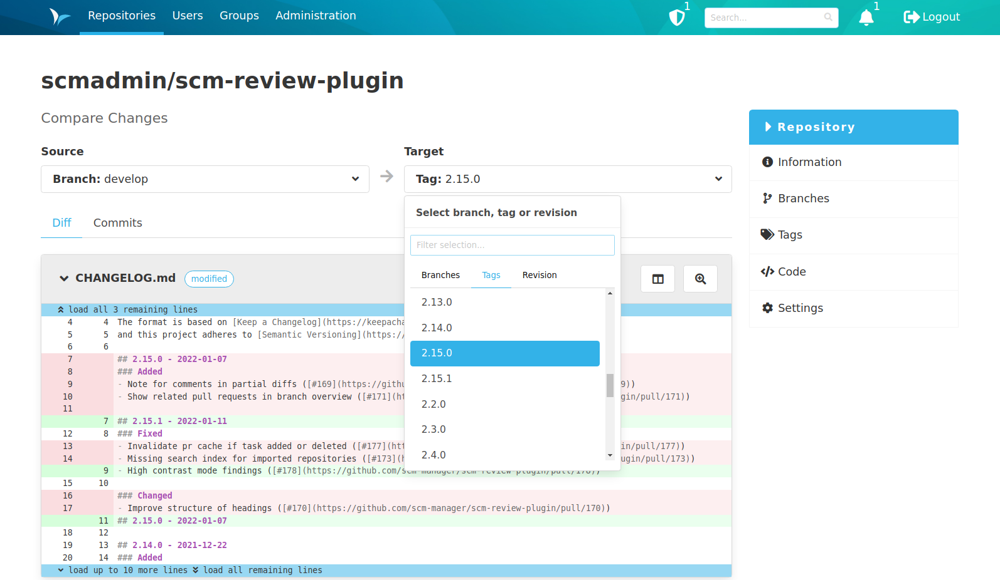
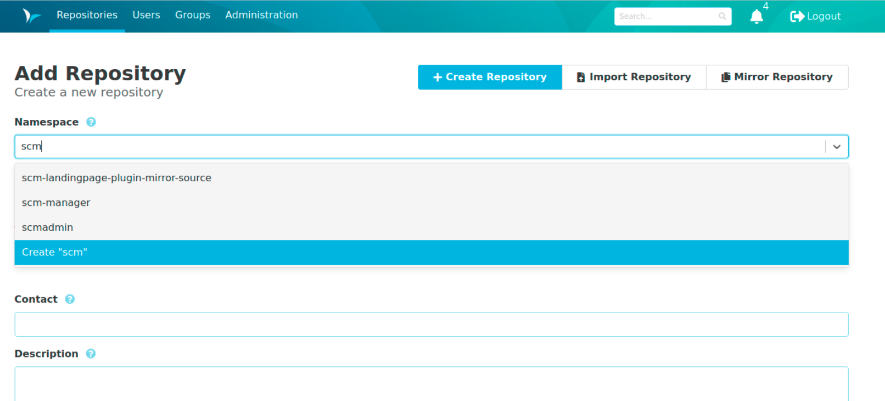

Hey SCM-Manager Community,

you may have read our last blog post warning you about a Path Traversal vulnerability in SCM-Manager.
If you haven't already, please update your instance to the latest SCM-Manager version as soon as possible to fix this issue.

## Alerting
We have already been working on an alert system that will warn you directly in your instance when an instance to warn you when a vulnerability is found that affects your installed SCM-Manager core and plugin versions.
To make sure you don't miss any important patches, each user is notified of existing security vulnerabilities.
These alerts in the header will only appear if there are known vulnerabilities that affect your installed versions.

## Compare
Another code related feature we have added is 'Compare'. 
You can now compare diffs and changesets between two branches, tags or revisions. 
This function can be found on the branch/tag detail page and at the top of the source viewer. 

Note: For revisions you can use the shortened version, but it must be a unique identifier.
Example: use `0b4c742` instead of `0b4c7429265cee9277766ddbbb2ad9a87f058d42`.

## Autocomplete
SCM-Manager uses the autocomplete component in several forms.
We have taken into account the feedback we have received about this component over the past few months and have revised it.
The biggest change for you should be that we now use autocomplete for repository namespaces in the creation form.

## Final words
Are you still missing an important feature? How can SCM-Manager help you improve your work processes?
We would love to hear from you about what you need most!

Do you have any questions or suggestions about the SCM-Manager?
Contact the DEV team directly on [GitHub](https://github.com/scm-manager/scm-manager/) and make sure
to check out our new [community platform](https://community.cloudogu.com/c/scm-manager/).
