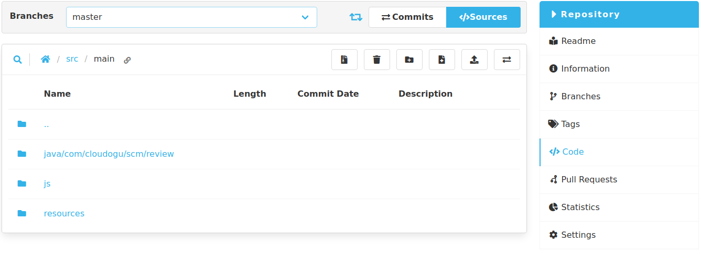

Hey SCM-Manager Community,

for the last month we worked on our backends and improved some stuff you hopefully should not notice. 
Therefore, this new release contains mostly smaller improvements and bugfixes.

## Collapsing empty directories
One new feature we've added is collapsing empty directories in the repository source view. 
You can still access these collapsed directories via the breadcrumb navigation.

## A11y - Accessibility
We have been working on the big topic of "accessibility" for quite some time.
Many of the requirements such as screen reader support or better keyboard support were more complicated than we expected. 
Although we will never stop working on accessibility, we should be done with the initial rebuild and can focus more on new features again. 
If you are depending on it, we are grateful for any kind of feedback.

## Final words
Are you still missing an important feature? How can SCM-Manager help you improve your work processes?
We would love to hear from you about what you need most!

Do you have any questions or suggestions about the SCM-Manager?
Contact the DEV team directly on [GitHub](https://github.com/scm-manager/scm-manager/) and make sure
to check out our new [community platform](https://community.cloudogu.com/c/scm-manager/).
