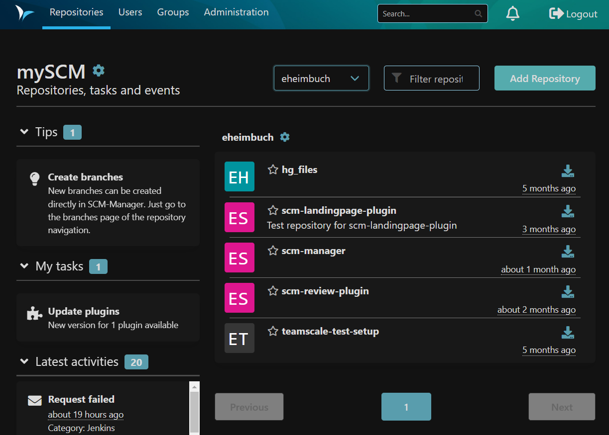
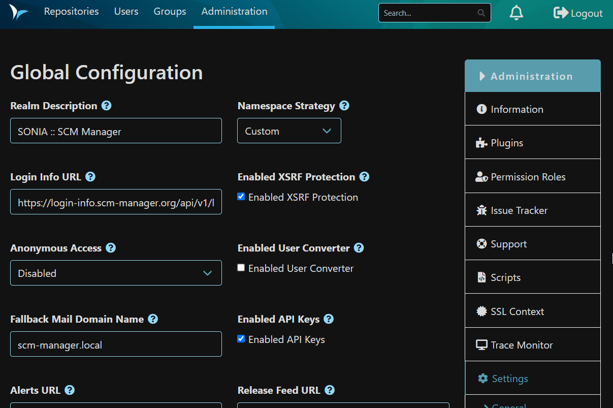
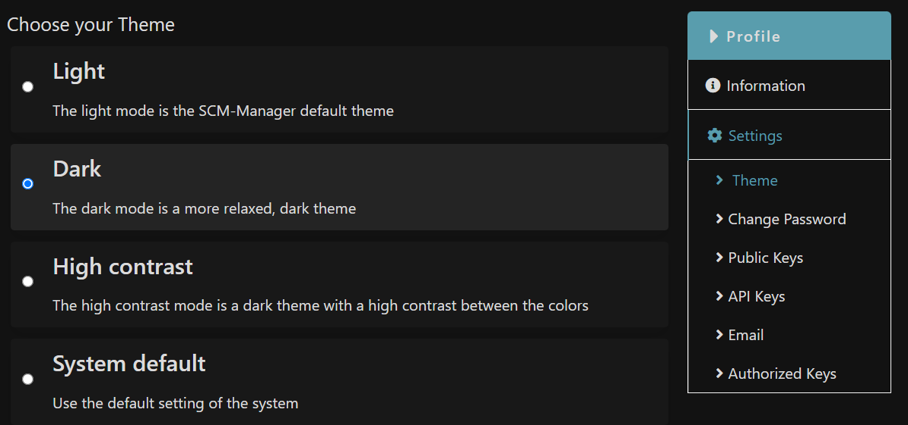
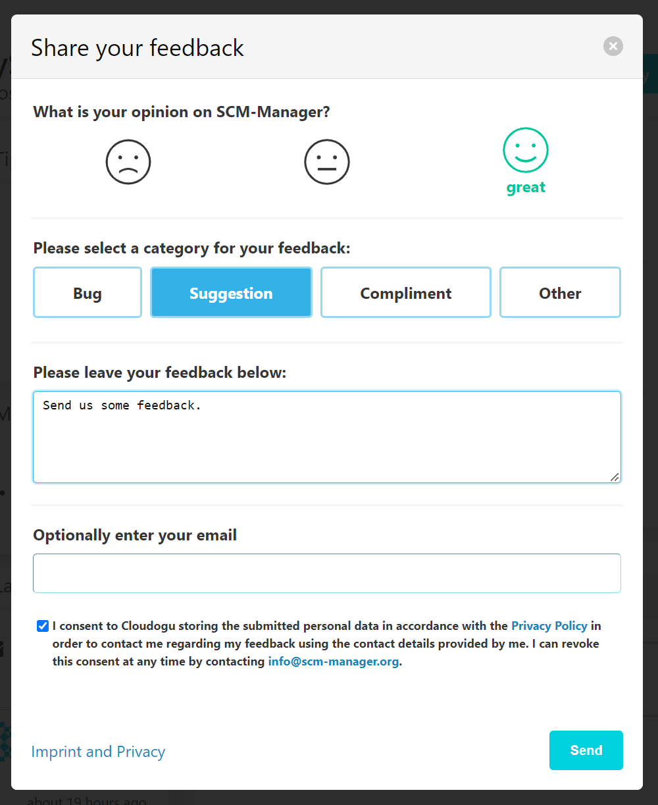

Hey SCM-Manager Community,

for the last month we focused on theming as we introduced the new dark mode. Besides, we worked on giving you the
opportunity to provide feedback directly from SCM-Manager.

## Dark mode
As high contrast mode targeted accessibility we also were in need for a more relaxed dark theme. The new official
dark mode has more relaxed colors which might help if you have to code late at night. 

## Feedback
We would like to get more feedback from you the user, and therefore we tried to make it more simple to provide us
feedback directly from within the SCM-Manager. You can use the button in the lower right corner to display a form and
easily submit your thoughts, suggestions and compliments.

Disclaimer: the data you provide will only be used by the SCM-Manager development team and will not be shared with
third parties. For further information check out our [Privacy Policy](/imprint).

## Final words
Are you still missing an important feature? How can SCM-Manager help you improve your work processes?
We would love to hear from you about what you need most!

Do you have any questions or suggestions about the SCM-Manager?
Contact the DEV team directly on [GitHub](https://github.com/scm-manager/scm-manager/) and make sure
to check out our new [community platform](https://community.cloudogu.com/c/scm-manager/).
