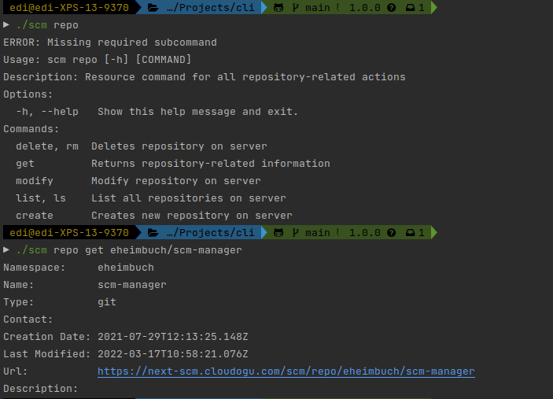

Hey SCM-Manager Community,

today we can proudly present the first version of the SCM-Manager CLI client. 
We also fixed lots of small and some bigger bugs which were reported by you.

## CLI
We and some community members have been wishing for a dedicated CLI for SCM-Manager for several years, and we finally got the opportunity to build a first version of it. 
The CLI client is available for many package managers and as a direct download on our [website](/cli/). We even support FreeBSD to support our power user Will Senn.
The client is mostly self-explanatory, there is nevertheless a [documentation](/docs/latest/en/user/cli/) for the setup and the general concepts behind it.

In the first version we focused on administrators and allow to manage repositories, users and groups. 
The CLI client already supports templating for many commands and provides translations for English and German.

To give you an idea of how the CLI could be used:

We already have more ideas to add for the CLI like plugin management, permission management or repository clone. 
If you miss anything for your workflows or scripts don't hesitate to give us feedback.

## Syntax Highlighting
Syntax Highlighting is a very big topic for SCM-Manager since we have different components which rely on this like Diff, Global Search, Blame View or File View. 
One bigger issue we had on this was that the browser happened to freeze with some huge files.

We managed to fix this issue by disabling the syntax highlighting dynamically if some certain threshold was exceeded. 
There it may occur that some of your files will no longer be highlighted properly.
Before your browser would simply crash, so this should be the better solution.

We actually have an idea to enable syntax highlighting on any file size but this is very complex, and we will deal with it in the future.

## Final words
Are you still missing an important feature? How can SCM-Manager help you improve your work processes?
We would love to hear from you about what you need most!

Do you have any questions or suggestions about the SCM-Manager?
Contact the DEV team directly on [GitHub](https://github.com/scm-manager/scm-manager/) and make sure
to check out our new [community platform](https://community.cloudogu.com/c/scm-manager/).
