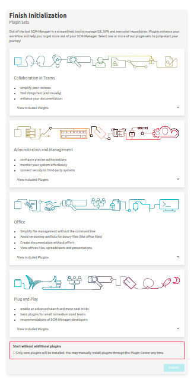
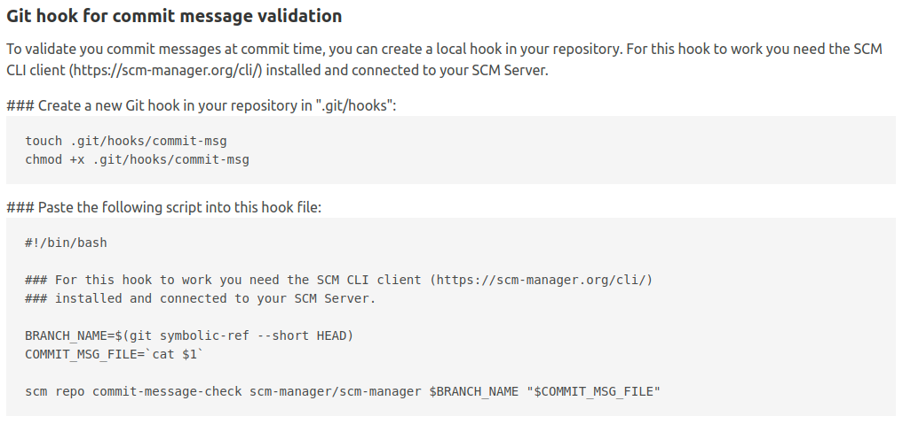

Hi SCM-Manager Community,

with the new release of SCM-Manager we made some significant changes we have to tell you about. Most importantly, if
you still use Java 8, now is the time to update your system.

## Java 11

From version 2.35.0 on, SCM-Manager has to be run at least with Java 11. If you still use Java 8, this is the time to
update, not only due to SCM-Manager, but also because Java 8 is out of maintenance. We have eagerly anticipated this for a long
time, because now we can use some nice new features of the more recent Java releases.

## Plugin Wizard

For those of you that are about to set up a new server, you will notice an additional initialization page: a plugin
wizard. We have thought about different use cases of SCM-Manager from personal usage up to big development teams.
We've done this, so that you can get the best experience possible from your SCM-Manager.

## Command Message Check

For some time now, we have the [Commit Message Checker](https://scm-manager.org/plugins/scm-commit-message-checker-plugin/).
With this, you can make sure that your commit messages comply with pre-defined rules. Though this is useful, it still may be
tedious, when you have created a bunch of commits locally before pushing them and just then being reminded about the
rules. With our new [CLI client](https://scm-manager.org/cli/) it is now possible to create a pre commit hook that will
check you commit message against the SCM-Manager server and doing so will ensure, that your commit will not be rejected
afterwards.

## Closing words
Are you still missing an important feature? How can SCM-Manager help you improve your work processes?
We would love to hear from you about what you need most!

Do you have any questions or suggestions about the SCM-Manager?
Contact the DEV team directly on [GitHub](https://github.com/scm-manager/scm-manager/) and make sure
to check out our new [community platform](https://community.cloudogu.com/c/scm-manager/).
