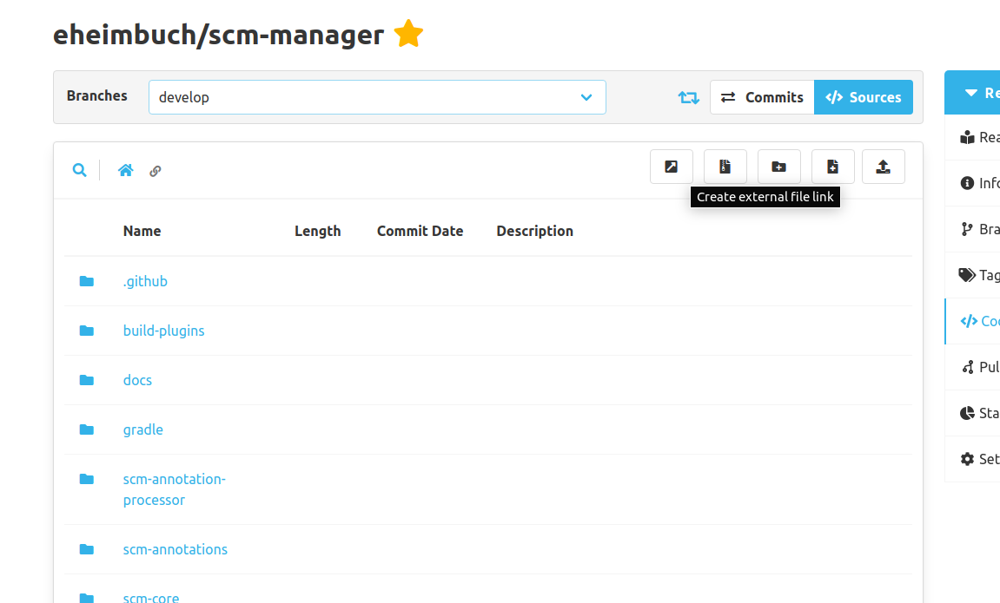
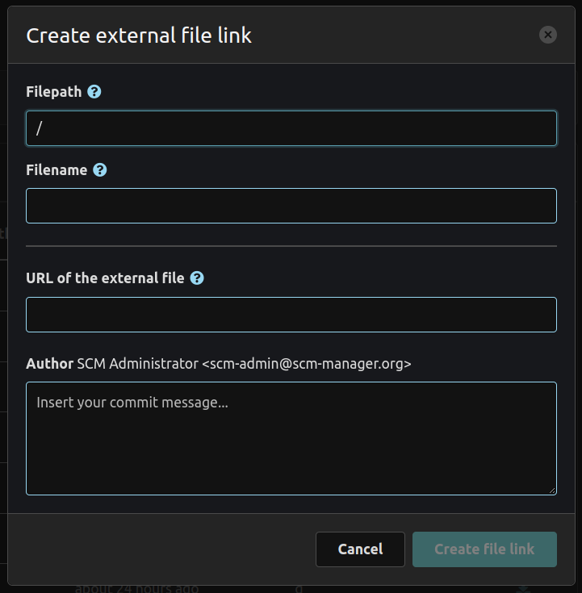
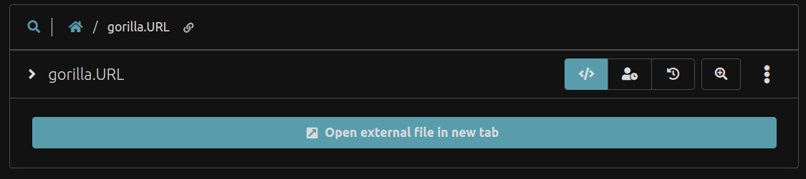

Hello SCM-Manager Community,

with every fresh release come new, exciting features that we do not want to keep from you. Beside the usual
bugfixes, we want to highlight three additions/changes this time.

## Git-LFS Support when Mirroring Repositories

A quite subtle, but much requested feature that we had to exclude in the initial
implementation of the repository mirroring feature due to complexity. It caused our team
many headaches, but ultimately we tamed the beast. Now, you can reap the benefits
by mirroring from sources that include git-lfs files. Yes, that includes SCM-Manager 1.x instances!

[Try it right now!](https://scm-manager.org/plugins/scm-repository-mirror-plugin/)

## New Plugin: External File Links

The latest addition to our plugin roster is useful especially for integrations with external file storage systems, where
you do not want to duplicate data but would still like to include a quick reference in your source code or documentation.

It adds a button to the source action bar where you can simply enter the external file's url and
a file name for your link and voilà, you just created a new external file link.

Of course, editing links is also possible and works quite similar to editing any other file through the [Editor Plugin](https://scm-manager.org/plugins/scm-editor-plugin/).

To visit one of those links, open the file and click the button that is boldly presented to you.

We made it work this way to keep the plugin compatible with other functionality in the SCM-Manager,
as a file link internally is just an ordinary file with a specific format.

[Check it out!](https://scm-manager.org/plugins/scm-external-file-plugin/)

## Updated Email Templates

Last but not least, we have performed a long-overdue tidy-up of the email templates in our [Mail Plugin](https://scm-manager.org/plugins/scm-mail-plugin/).

Just to give one example, expect the pull request related emails sent by your [Review Plugin](https://scm-manager.org/plugins/scm-review-plugin/) to look that much neater!

## Closing words
Are you still missing an important feature? How can SCM-Manager help you improve your work processes?
We would love to hear from you about what you need most!

Do you have any questions or suggestions about the SCM-Manager?
Contact the DEV team directly on [GitHub](https://github.com/scm-manager/scm-manager/) and make sure
to check out our new [community platform](https://community.cloudogu.com/c/scm-manager/).
