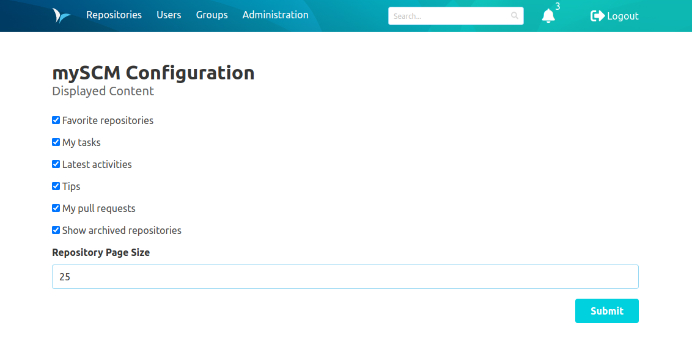
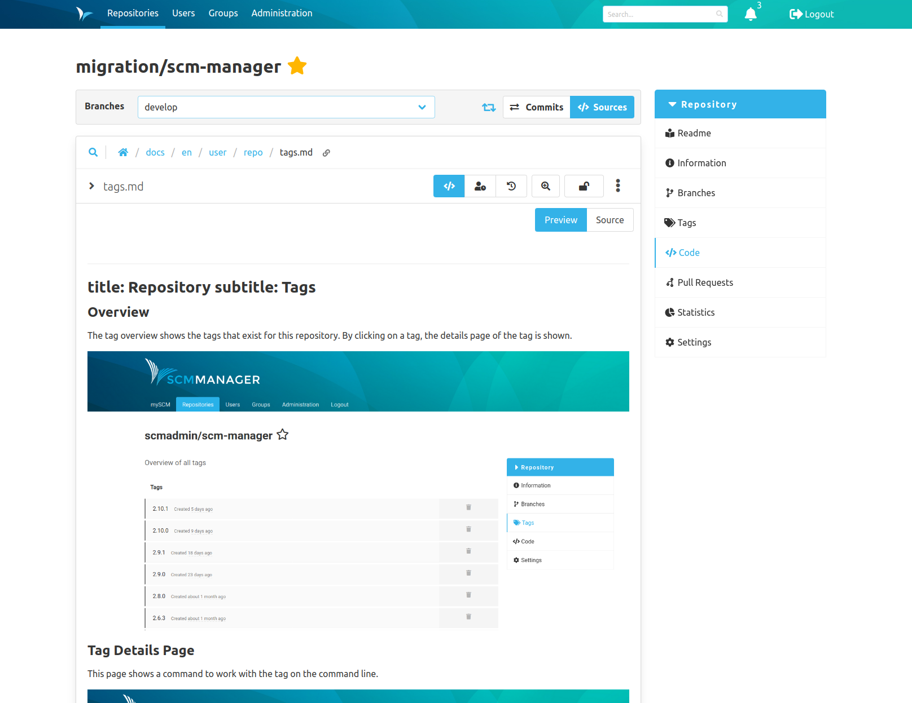

Dear SCM-Manager Community,

you haven't heard of us for two months now, but we haven't been idle all the time. Last week,
we released version 2.41.0 of SCM-Manager with two features requested by you, our community.

## Configurable repository list

Some of you want to change the amount of repositories on the startup page or hide
archived repositories. You can do
this now with the [Landingpage Plugin](https://scm-manager.org/plugins/scm-landingpage-plugin/).
If you have not taken a look at it before, now it is the time to do so. Besides the ability
to change the page size or to hide archived repositories, it can also show the latest activities,
information about pull requests and you can mark repositories as favorites so that they are always
at the top of the first page.

You can find the new configuration options by pressing the small settings icon next to the header
"mySCM" on the top of the repository page. There, you can also deactivate features you do not
want to use.

## Image resolution in Markdown

Maybe you are as great a fan of Markdown as we are. Then you will most probably be glad to hear
about our latest fix: Relative image paths in markdown documents will now be displayed correctly
in the previews. This also holds true for the [Review Plugin](https://scm-manager.org/plugins/scm-review-plugin/).

## Small fixes

You may notice other smaller fixes, for example sticky file headers in diff views or that the
namespace is preselected whenever you create a new repository after you selected a namespace.

## Closing words
Are you still missing an important feature? How can SCM-Manager help you improve your work processes?
We would love to hear from you about what you need most!

Do you have any questions or suggestions about the SCM-Manager?
Contact the DEV team directly on [GitHub](https://github.com/scm-manager/scm-manager/) and make sure
to check out our new [community platform](https://community.cloudogu.com/c/scm-manager/).
