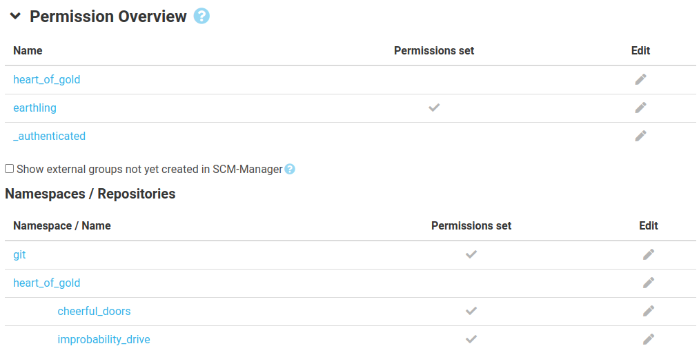
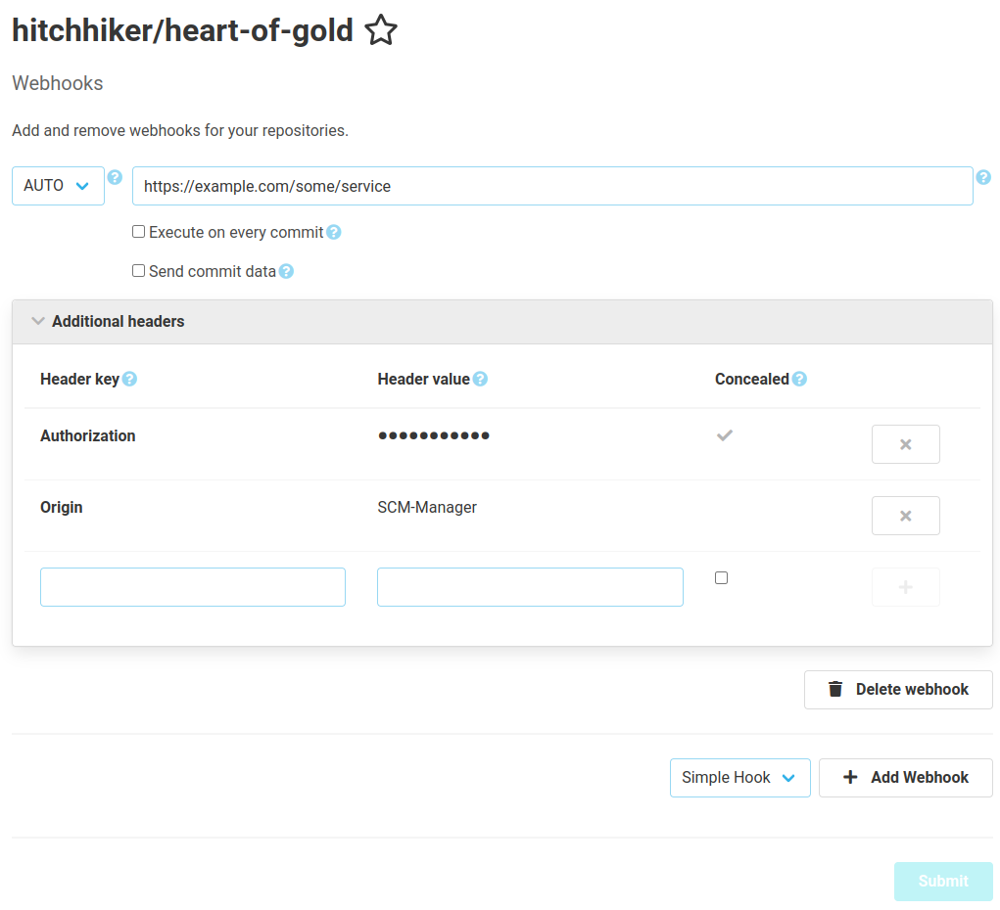

Dear SCM-Manager Community,

after almost a month, we have a new version for you. You might notice that there is already a 
[bugfix version 2.42.1](https://scm-manager.org/download/2.42.1). 
The reason for that was a conflict between the updated svn library and our ssh plugin. We fixed this immediately and 
thus released [version 2.42.1](https://scm-manager.org/download/2.42.1).

Apart from that we want to inform you about two new features: a new permission overview and new possibilities for 
webhooks. Additionally, you now have the option to save default reviewers for pull requests. 

## Overview for Permissions

As there are many permissions to manage within the SCM-Manager, it can get quite cluttered and confusing which 
permissions are set for different users and groups. Additionally, users can be sorted into groups via external systems 
such as LDAP or CAS. Until now, admins could not access an overview over such external groups. 

To tackle those two problems, the new version comes with an integrated permission overview. The overview can be accessed 
via the information page for each user. Within this overview you can see all groups that a user got assigned to at their 
last login. Underneath you will find a table with information on all namespaces and repositories which have permissions 
directly set for the user and their groups.

## Headers for Webhooks

A frequently asked for feature were headers for webhooks, which we now implemented in the 
[Webhook Plugin](https://scm-manager.org/plugins/scm-webhook-plugin). Assigned passwords can be concealed, so they will 
neither be stored as clear text nor shown on the user interface.

## Closing words
Are you still missing an important feature? How can SCM-Manager help you improve your work processes?
We would love to hear from you about what you need most!

Do you have any questions or suggestions about the SCM-Manager?
Contact the DEV team directly on [GitHub](https://github.com/scm-manager/scm-manager/) and make sure
to check out our new [community platform](https://community.cloudogu.com/c/scm-manager/).
