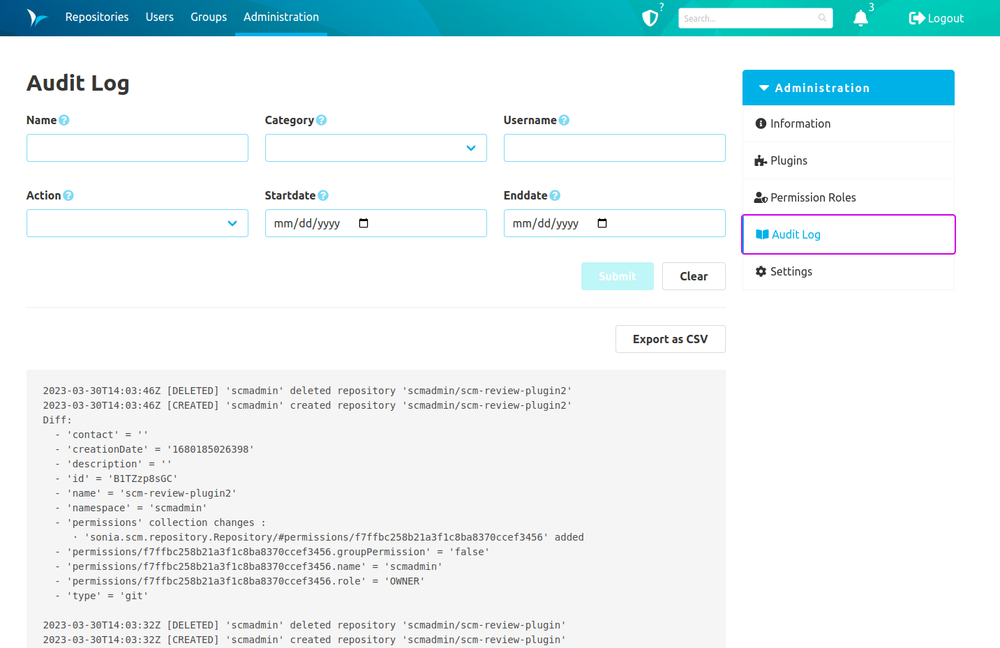
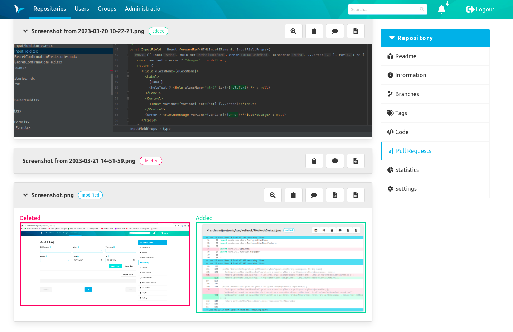

Dear SCM-Manager Community,

the new version fixes several bugs reported by you. 
We want to especially mention that we fixed the frontend bug with SVN externals which was accidentally broken some releases ago.
Also, we improved the permission handling for Mercurial so that most extensions which were unsupported should work now with SCM-Manager.
Thanks again to Matt Harbison for the suggestions on how to optimize the extension support.

## Audit Log

A new feature we added is the Audit Log for SCM-Manager. You can activate it by downloading the new plugin. 
It keeps track of all changes which create, modify or delete data in SCM-Manager.
Repository configurations are also tracked but repository internal changes are explicitly ignored since they already version themselves.

## Images in diffs

Another new feature that was missing for quite a long time are images for diffs. 
You will now see your rendered image files for single changesets, using the compare view and also for pull requests diffs.
We are already planning to add more view modes for these images like "dynamic slider".

## Accessibility: New UI libraries

SCM-Manager is free to use and available for many platforms. But we also want it to be accessible to use for most users which is certainly not an easy task to do.
Some first steps were to create multiple themes and improve keyboard navigation. Right now we are creating new UI libraries for SCM-Manager development. 
We hope it will not only improve the UI/UX but also boost our development speed and maybe even motivate new plugin developers to write own extensions.

## Closing words
Are you still missing an important feature? How can SCM-Manager help you improve your work processes?
We would love to hear from you about what you need most!

Do you have any questions or suggestions about the SCM-Manager?
Contact the DEV team directly on [GitHub](https://github.com/scm-manager/scm-manager/) and make sure
to check out our new [community platform](https://community.cloudogu.com/c/scm-manager/).
