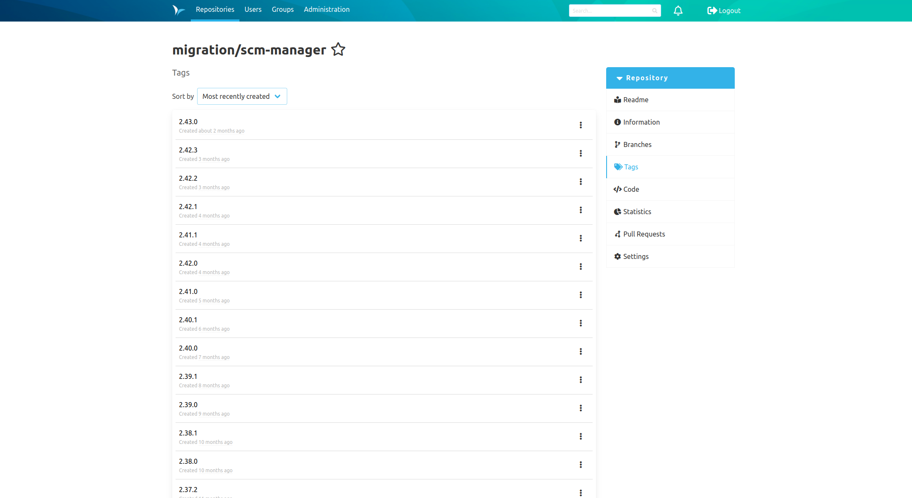
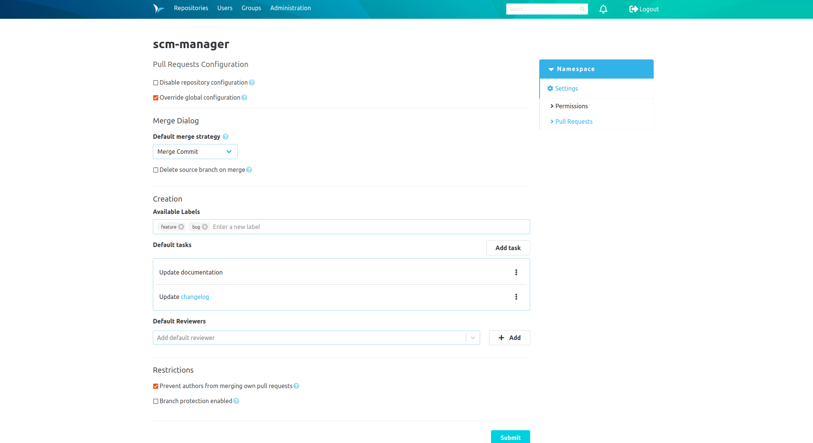
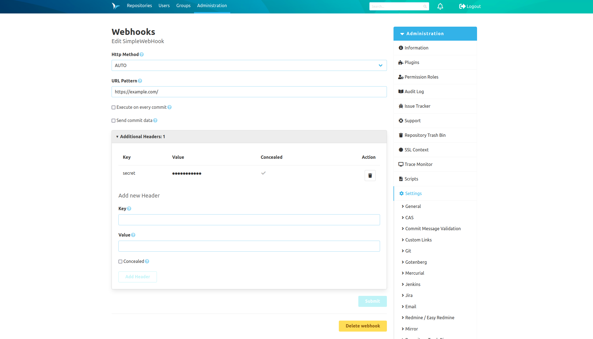

Dear SCM-Manager Community,

the new version comes with some improvements. This includes the tag overview, the review plugin and the webhooks.

## Tag Overview

The tag overview of your repository comes with a slightly new look. Functions, such as deleting a tag, are now hidden
behind a three-point menu. This is a change that will be implemented in the future on other views, such as the branch 
and pull request overviews. Especially there it should provide a better overview.

## Review plugin

The new version of the review plugin introduces some new features. It is now possible to provide pull requests with 
labels, such as 'feature' or 'bug', and default tasks, such as 'Update documentation' or 'Update changelog'. Furthermore
it is possible to configure a default merge strategy. In addition, configurations can now be made at the namespace level.

## Webhooks

The webhook configuration shines in a new design, which should significantly increase the clarity when creating or 
editing a webhook.

## Closing words
Are you still missing an important feature? How can SCM-Manager help you improve your work processes?
We would love to hear from you about what you need most!

Do you have any questions or suggestions about the SCM-Manager?
Contact the DEV team directly on [GitHub](https://github.com/scm-manager/scm-manager/) and make sure
to check out our new [community platform](https://community.cloudogu.com/c/scm-manager/).
