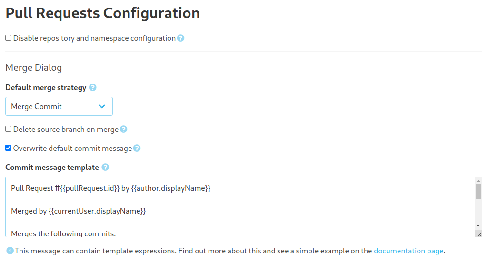
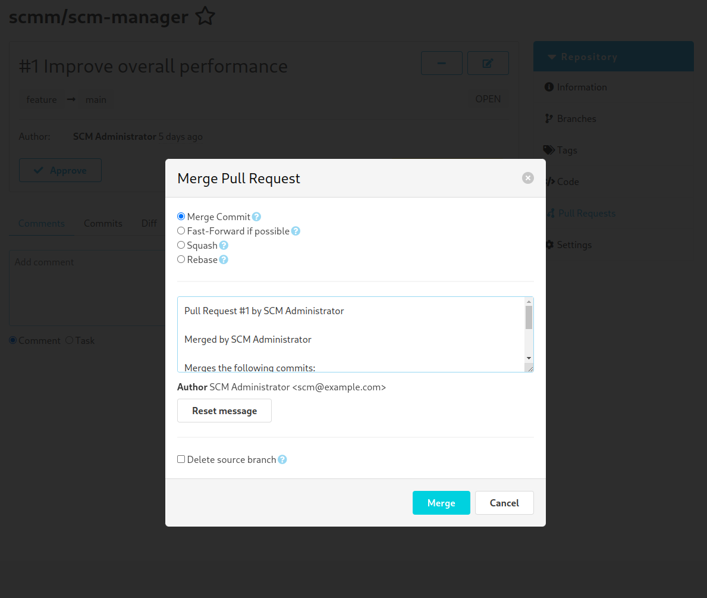

Dear SCM-Manager Community,

apart from some new features and bugfixes, we focused on the UI performance of SCM-Manager in the last weeks and we
would love to get feedback for this. So keep on reading and check out, whether you can improve your experience.

## Performance

To be honest, the increased number of plugins slowed down SCM-Manager a bit when there are many repositories to handle.
Especially [the landing page](https://scm-manager.org/plugins/scm-landingpage-plugin/) could take a while to load.
So we figured out that it is time to take a look at the overall performance. We identified three major fields, where
we could do something:

1. **Stores**: One benefit of SCM-Manager from our point of view is, that it is independent of any database engine. You do not need
   to set up a Postgres or a MySQL database alongside SCM-Manager and there is no need for additional back-ups besides
   the scm-home directory. A downside on this is, that handling lots of XML files (which are used by SCM-Manager to
   keep its data) takes its time.
   
   To increase performance on this, we added caches for all XML based stores in SCM-Manager. To use this caching,
   you have to enable this explicitly by setting the property `scm.cache.dataFileCache.enabled` to `true` for
   data caching and `scm.storeCache.enabled`, to enable caches for configurations.
2. **Authorization**: While processing a request, SCM-Manager checks permissions quite often. We detected a bit of
   overhead here, because internal models were copied internally without explicit need. We cleaned this up and on the
   way clean up logging a bit.
3. **Waterfall-style requests**: When the [landing page](https://scm-manager.org/plugins/scm-landingpage-plugin/) is
   installed, its features like favorite repositories, tasks, and other items were triggered only after the actual
   repositories have been loaded. There is no reason for this, so now all parts of the landing page will start
   loading at once and the full page should be present faster.

## Java 17

In addition to the performance improvements, we updated our docker images and the rpm and deb packages to use Java 17
by default. If you run into any issues with this, please feel free to contact us! We hope, that using Java 17 might
lead to additional performance improvements, too.

## Default Merge Message

If you use the review plugin to improve your development process, you might find it useful to use custom commit
messages for merge pull requests. Now, you can configure custom templates for this. For these templates, we use
the well established [Mustache template engine](https://mustache.github.io).

## Closing words
Are you still missing an important feature? How can SCM-Manager help you improve your work processes?
We would love to hear from you about what you need most!

Do you have any questions or suggestions about the SCM-Manager?
Contact the DEV team directly on [GitHub](https://github.com/scm-manager/scm-manager/) and make sure
to check out our new [community platform](https://community.cloudogu.com/c/scm-manager/).
