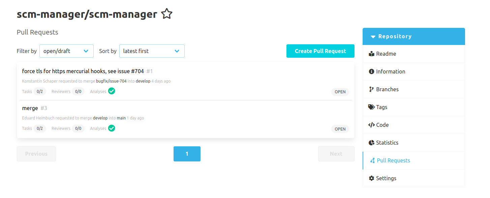
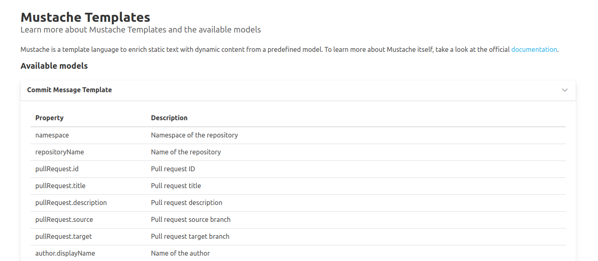
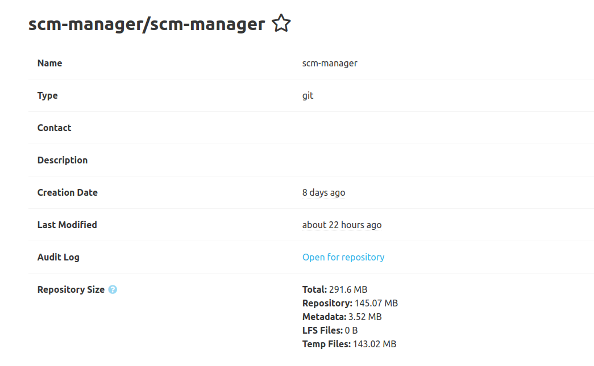
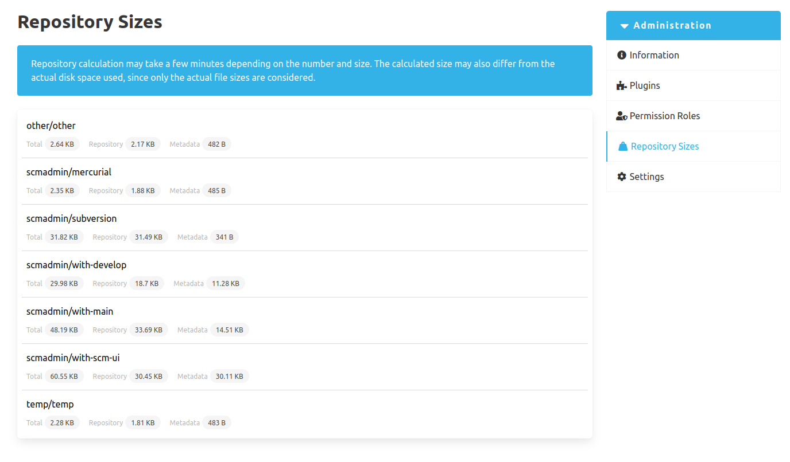

Dear SCM-Manager Community,

today we released the new version of the SCM-Manager 2.46.0.
This release focused on fixing bugs issued from the community, reworking ui components and releasing two new plugins.

## UI Rework

We have finally finished the rework of the branches, tags and pull requests views.
They are now using the new card based layout, which is heavily focused on better UX and accessibility.
As always we are depending on your feedback, so that we can be sure, that we are moving to the right direction.

## Mustache Template Plugin

For a long time SCM-Manager has supported Mustache as a template engine.
But most users had the issue not knowing how to actually use the feature.
Therefore we developed a plugin to document the models available in the Mustache templates.

## Repository Size Plugin

One important information that was missing in the SCM-Manager, is the actual size of each repository.
SCM-Manager repositories not only consist of the repository data but also include metadata, LFS files and some internal temp files for operating the repository.
You can now see the actual sizes on the repository information page

Administrators can get an insight of every repository size on one consolidated list.

## Closing words

Are you still missing an important feature? How can SCM-Manager help you improve your work processes?
We would love to hear from you about what you need most!

Do you have any questions or suggestions about the SCM-Manager?
Contact the DEV team directly on [GitHub](https://github.com/scm-manager/scm-manager/) and make sure
to check out our new [community platform](https://community.cloudogu.com/c/scm-manager/).
