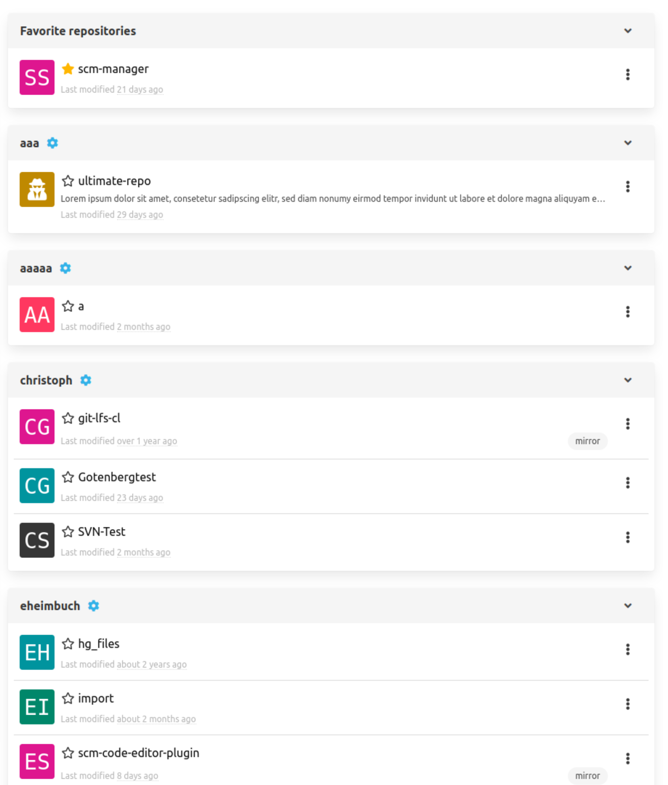

Dear SCM-Manager Community,

today we released the new version of the SCM-Manager 2.47.0.
Alongside this core release we have released over 10 plugin upgrades improving accessibility and fixing various bugs.

## Repository List Overhaul

We are continuously evaluating the accessibility and usability of our user interface to provide the best possible experience for all kinds of users.
In this iteration, we have refactored the repository list on the landing page to meet modern accessibility standards and be more clear in its communication.
Additionally, users can now collapse individual namespaces which is persisted while browsing the application.

We have also improved our checkboxes, the chip input, all our new card layouts, the global search bar and several plugins with similar goals in mind.
Check out the [Review Plugin](https://scm-manager.org/plugins/scm-review-plugin/releases/) for example.

## What's next

This will be the last planned feature release before we are bringing out a new major version of the SCM-Manager.
In this release, we are tackling an important upgrade of our core dependencies to future-prove the system.
Most if not all plugins should work out of the box but the core might need some manual adaptions if you are using custom jetty configurations.
We are going to release more information in the accompanying blog post once it's ready.

## Closing words

Are you still missing an important feature? How can SCM-Manager help you improve your work processes?
We would love to hear from you about what you need most!

Do you have any questions or suggestions about the SCM-Manager?
Contact the DEV team directly on [GitHub](https://github.com/scm-manager/scm-manager/) and make sure
to check out our new [community platform](https://community.cloudogu.com/c/scm-manager/).
