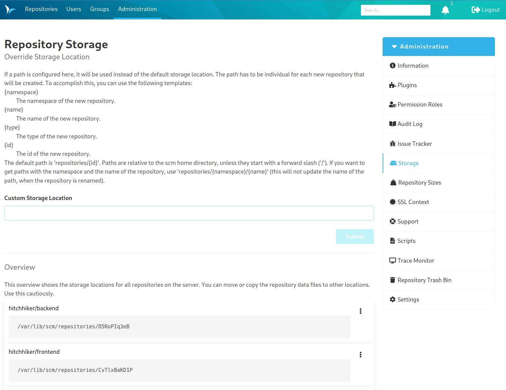

Dear SCM-Manager Community,

today we released the new version of the SCM-Manager 2.48.0 (to be honest, it's 2.48.1 due to a small bug in the ui).
For some of you, the most important new feature comes with an new plugin: The [Custom Storage Plugin](https://scm-manager.org/plugins/scm-custom-storage-plugin/).

## Custom Storage Plugin

With version 2.x of SCM-Manager we changed the way, how repositories are stored. Instead of using the repository type
and name for the directory structure, we now use the id of the repository. This makes it easier to handle renames of
repositories and to handle special characters in the name. But it also makes it harder to handle repositories outside
SCM-Manager, like backup or using other mounted directories.

The new [Custom Storage Plugin](https://scm-manager.org/plugins/scm-custom-storage-plugin/) allows you to configure
the directory structure of your repositories. You can use the repository type, name, id or any combination of these
to configure the directory structure. You can even use a custom template to configure the directory structure for
new repositories.

## Signature Check Plugin

The [Signature Check Plugin](https://scm-manager.org/plugins/scm-signature-check-plugin/) allows you to check the
signature of commits. This is useful, if you want to make sure, that commits are signed by a trusted person.

## Other changes

* It is now possible to rebuild the search index and invalidate all caches in SCM-Manager. This might be useful, if you
  experience inconsistent data in SCM-Manager. You can find this feature in the global settings.
* The [Repository Size Plugin](https://scm-manager.org/plugins/scm-repository-size-plugin/) will now load the sizes
  of the repositories one by one. This should provide a better user experience, if you have a lot of repositories or
  very big ones.
* You, the community, found a bug regarding the branch protection in the review plugin. This is fixed now.
* If you are using the [SSH Plugin](https://scm-manager.org/plugins/scm-ssh-plugin/), you can now set your preferred
  protocol for the information page.

... and a lot of other small improvements and bugfixes. Please make sure to update your plugins, too!

## Closing words

Are you still missing an important feature? How can SCM-Manager help you improve your work processes?
We would love to hear from you about what you need most!

Do you have any questions or suggestions about the SCM-Manager?
Contact the DEV team directly on [GitHub](https://github.com/scm-manager/scm-manager/) and make sure
to check out our new [community platform](https://community.cloudogu.com/c/scm-manager/).
