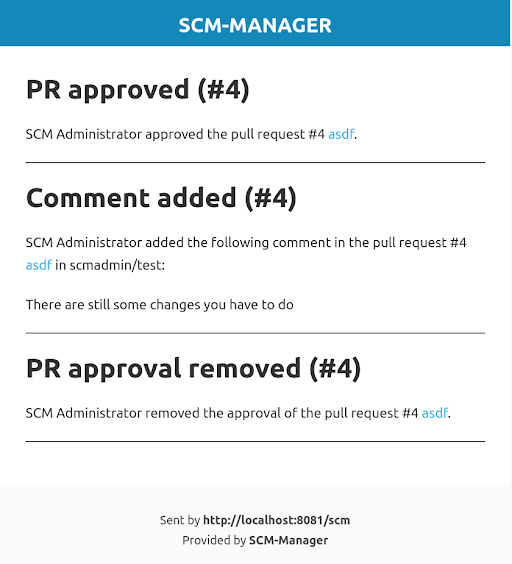
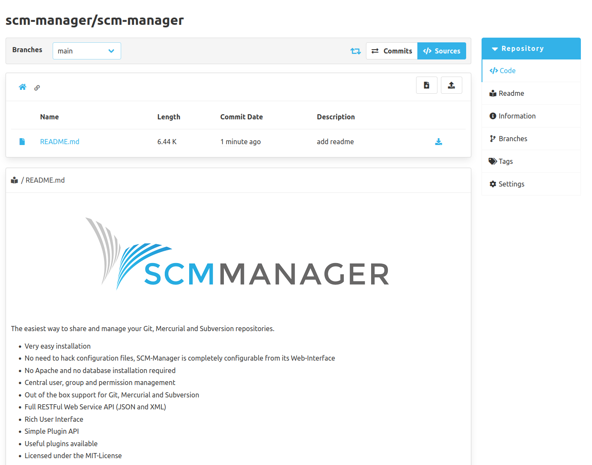
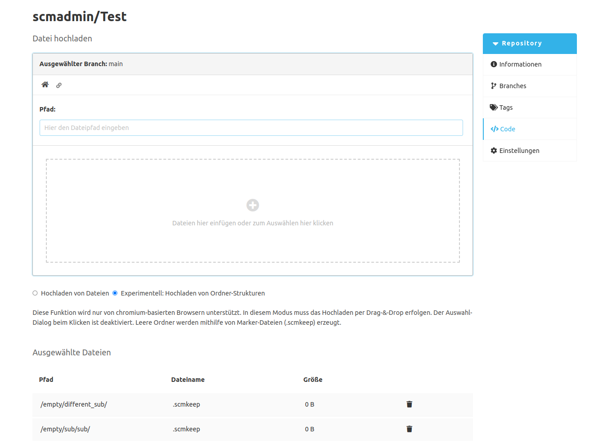

Dear SCM-Manager Community,

today we released the new version of the SCM-Manager 3.1.0.
This release focused on performance, various bug fixes and new features in over 8 plugins

## Performance improvements

We improved the speed of repository imports and mirrors by optimizing the scan of commits in each branch and tag.
Additionally, the user can ignore the import of LFS files to enhance the performance.
Previously the import of a large repository like the linux kernel could have taken days, but after the optimization it only takes several minutes. 

In some cases we encountered the issue that events of the same type blocked the event bus, for example indexing new repositories.
Because one specific event handler could only be executed once at the same time and therefore blocking the execution threads for other event handlers.
As an event handler is submitted for execution, we now check if the event handler is already being executed by a different event. 
If that is the case, we postpone the execution of the new event without blocking the execution threads with waiting event handlers.

## Mail Plugin

The SCM-Manager supports email notifications for various events.
In the past this could lead to the users inbox getting flooded with many notifications in a short period of time.
To prevent this issue, we implemented a feature to summarize multiple emails into one.
The summarization behaviour can be configured by the user in multiple ways.
The documentation of the configuration can be found under the Mail Plugin.

## Readme Plugin

In the past the readme of a repository was shown on its own page within the repository.
Now the readme was moved to the code section of the repository and is rendered below the file tree.
The readme page used to only show the content of a readme file from the root path of the default branch.
With this update the readme section is displaying the content of a readme file from the currently selected branch and path.
If the current path and branch do not contain a readme file, then nothing gets shown.

## Upload of directories

In the current editor plugin it is possible to upload files.
In the upload dialog it is now possible, to also upload empty directories.
If you upload an empty folder we will generate a `.scmkeep` file to prevent the directory from being ignored by the version control system.
Sadly this feature is only usable in chromium based browsers.
This feature is somewhat unstable, but we want you to try this out and leave some feedback.

## Other changes

* If you have an open pull request, it is possible to change the target branch
* It is possible to reopen a rejected pull request
* The decision to delete the source branch after the merge can be made while creating the pull request
* You can leave the editor with the keyboard now
... and a lot of other small improvements and bugfixes. Please make sure to update your plugins, too!

## Closing words

Are you still missing an important feature? How can SCM-Manager help you improve your work processes?
We would love to hear from you about what you need most!

Do you have any questions or suggestions about the SCM-Manager?
Contact the DEV team directly on [GitHub](https://github.com/scm-manager/scm-manager/) and make sure
to check out our new [community platform](https://community.cloudogu.com/c/scm-manager/).
