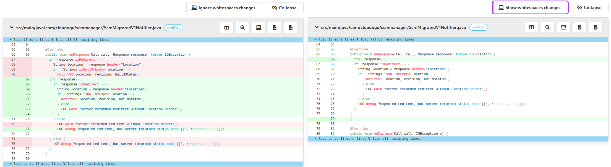
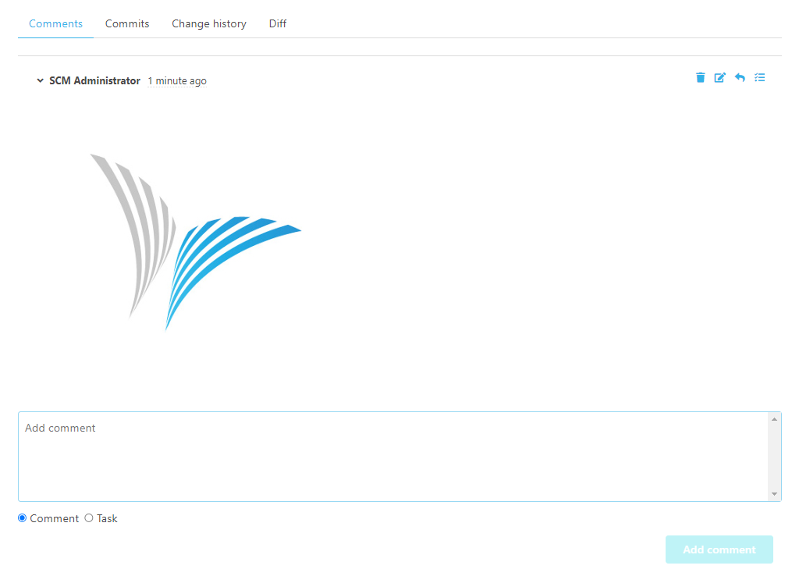

Dear SCM-Manager Community,

today we released the new version of the SCM-Manager 3.2.0.
This release is focused on some new features and various bugfixes in 3 plugins.

## Whitespace changes

There is now an option to hide whitespace changes. This should make it easier to focus on the actual changes and reduce noise.
The buttons are located in the changeset view as well as in your pull requests.

Furthermore, it is possible to show and hide your whitespaces and tabs in your file.

## Review Plugin

It is now possible to add images to your comments by copy and pasting them into the textarea. Currently, we support images with the file format JPG, PNG or GIF. The maximum size of an image is currently limited to 8MB.
This is an early implementation, and we are planning to improve it. For example by adding the drag and drop support of images.

In your pull request, the target branch can only be changed when no other pull requests with the same branch exist and the new pull requests has differences.
Moreover, the pull request UI got upgraded with a sticky header that lets you see the important information, even while scrolling down.

Additionally, there were also several small improvements and bugfixes. Please make sure to update your plugins, too!

## Closing words

Are you still missing an important feature? How can SCM-Manager help you improve your work processes?
We would love to hear from you about what you need most!

Do you have any questions or suggestions about the SCM-Manager?
Contact the DEV team directly on [GitHub](https://github.com/scm-manager/scm-manager/) and make sure
to check out our new [community platform](https://community.cloudogu.com/c/scm-manager/).
