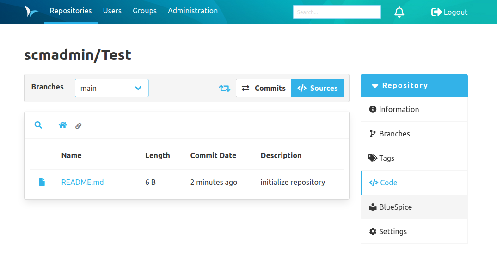
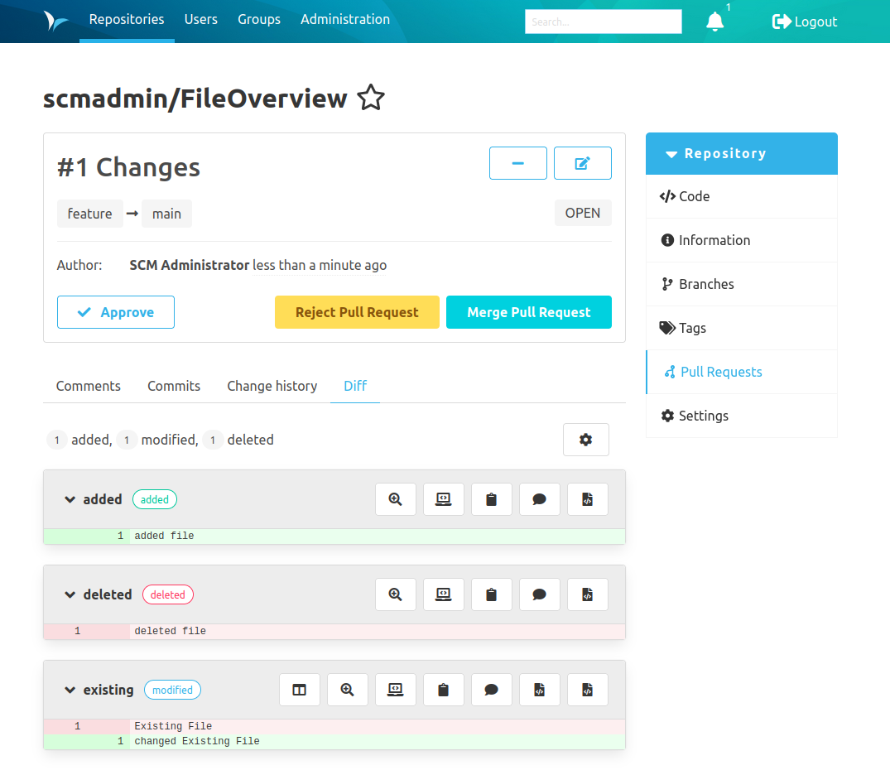
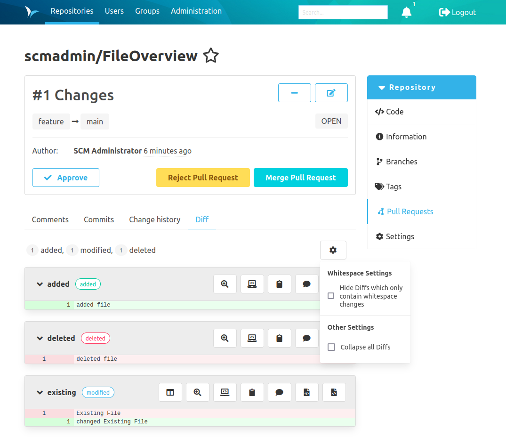
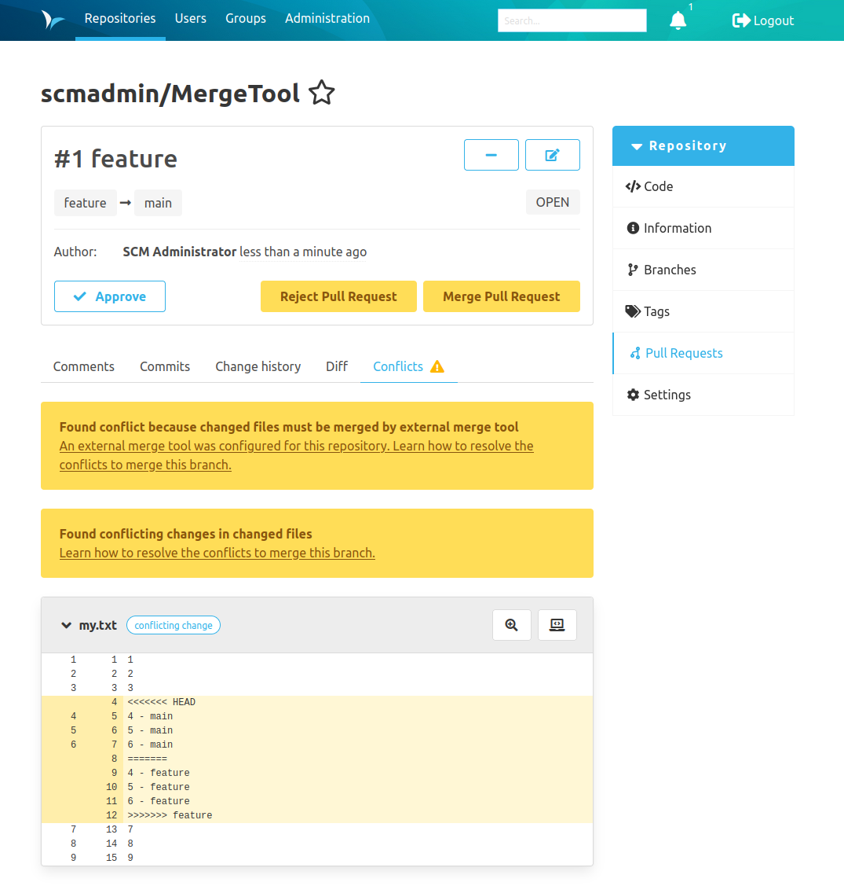

Dear SCM-Manager Community,

today we released the new version of the SCM-Manager 3.4.0.
In this release cycle we put a huge emphasis on improving the user experience of working with pull requests and changesets.
Additionally this release contains multiple new features and various bugfixes in three plugins and one newly released plugin, the BlueSpice plugin.

## BlueSpice Plugin

[BlueSpice](https://bluespice.com/) is a free and open source tool for creating your own wiki and knowledge base.
BlueSpice is frequently used in combination with the SCM-Manager within the [Cloudogu Ecosystem](https://cloudogu.com/en/ecosystem/), for documentation purposes.
The aim of this plugin is to bring the documentation from a BlueSpice instance closer to the associated repositories,
by providing a direct link from the repository sidebar to the corresponding documentation page, 
made available by a BlueSpice instance.
For further information on how to use this plugin, take a look at the [plugin documentation page.](/plugins/scm-bluespice-plugin/docs)

## Modified Files Overview in Changeset and Diff Views

To improve the user experience, working with changesets and diffs, 
we added an overview of the amount of files that are added, modified and deleted by a pull request / changeset.
This overview can be seen at the top of the diff / changeset view.
We added this feature based on the feedback of current users.
With this feature, it should be easier to estimate the actual size and complexity of a pull request / changeset.

## Cogwheel Menu in Changeset and Diff Views

To reduce the confusion created by ambiguous or confusing icon buttons,
we have replaced the buttons at the top of the diff view with a drop-down menu,
indicated by a cogwheel icon.

## External Merge Tools 

With git and a `.gitattributes` file it is possible, to define an external merge tool for certain files.
In earlier versions the SCM-Manager the review plugin did not consider these merge tools and tried to merge the files on his own.
If you now try to merge two branches that cannot be merged with a fast forward and at least one of the modified files requires an external merge tool, 
a conflict appears in the pull request view with the message that the pull request contains files which can only be merged by an external merge tool.

## Repository Mirror Plugin

In previous versions of the repository mirror plugin,
there was a problem that mirrors were updated even though this mirror had already been deleted.
This resulted in the server log being flooded with exceptions at regular intervals.
Until now, only a restart of the SCM-Manager could solve this problem for a deleted mirror.
The latest version of this plugin fixes this error entirely,
by cancelling the update schedule upon mirror deletion.

## Closing Words

Are you still missing an important feature? How can SCM-Manager help you improve your work processes?
We would love to hear from you about what you need most!

Do you have any questions or suggestions about the SCM-Manager?
Contact the DEV team directly on [GitHub](https://github.com/scm-manager/scm-manager/) and make sure
to check out our new [community platform](https://community.cloudogu.com/c/scm-manager/).
